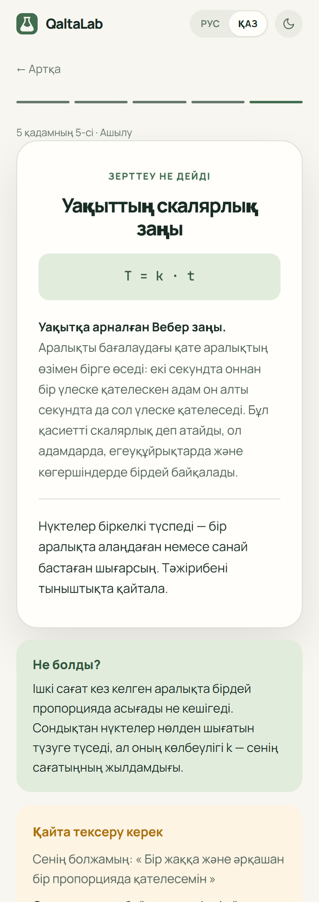

<div align="center">


# QaltaLab

**Зертхана қалтаңда · Лаборатория в кармане · A lab in your pocket**

Real science experiments on the phone a student already has —<br>
measure, plot your own data and discover the law yourself.

[](https://qaltalab.site)
[](#)
[](#)
[](#tech)
[](#)
[](LICENSE)

### **[→ Open QaltaLab](https://qaltalab.site)**

**[English](#english)** · **[Русский](#русский)**


</div>

---

<a id="english"></a>

## English

### The problem

Not every school has a lab, equipment and consumables — especially in small towns and
villages. So physics and other STEM subjects often stay pure theory: a formula, a
worked example and one correct answer.

Kazakhstan has [8,048 schools](https://stat.gov.kz/ru/news/bolee-8-tysyach-shkol-kazakhstana-nachali-novyy-uchebnyy-god/).
In 2024, [967 of them received new subject classrooms](https://www.gov.kz/memleket/entities/edu/documents/details/836066).
That is progress, but it's the number for one year, and even an equipped classroom is
out of reach at home, when a student actually wants to try something.

### The solution

A phone already has a microphone, a speaker, a camera and a precise touch screen.
QaltaLab turns them into measuring instruments and walks the student through the
full scientific method:

| Step | What happens |
|---|---|
| **1. Question** | A clear question, not "read the paragraph": why does an empty bottle hum low and a full one high? |
| **2. Hypothesis** | The student commits to a prediction **before** the experiment. Being wrong is allowed — and discussed. |
| **3. Measurement** | The phone measures for real: frequency from the mic, pulse from the camera, time and taps from the screen. |
| **4. Fitting** | No formula on screen. The student moves sliders until the curve fits **their own points**; `R²` is recalculated on every move. |
| **5. Discovery** | Only now: the law's name, the formula, the scientist — and **"What happened?"** in plain words. |

Every experiment has its own link (e.g. [qaltalab.site/#/lab/hearing](https://qaltalab.site/#/lab/hearing)) — a teacher can send it to a class, no registration. The result can be saved as a PNG card with the chart. Microphone and camera are requested only after a short explanation, and a blocked permission leads to clear instructions instead of a dead end.

After the result the student can press **"What if we try it differently?"** — repeat the
experiment in new conditions (left hand, after squats, with music). The new points land
on top of the old ones, so the difference is visible right on the chart.

### Nine experiments

| Experiment | Instrument | Law you discover | You also need |
|---|---|---|---|
| **Bottle orchestra** | microphone | Helmholtz resonance, f ∝ 1/√V | a bottle and water |
| **Pendulum** | screen (tap counter) | T = 2π√(L/g) — and you get *g* | a thread and an eraser |
| **Your hearing** | speaker | the upper audible frequency on this device | — |
| **Sense of time** | screen | scalar timing, T = k·t | — |
| **Speed of thought** | screen | Hick's law (1952) | — |
| **Fitts's law** | screen | T = a + b·log₂(2D/W) | — |
| **How fast you learn** | screen | power law of practice | — |
| **Magical number seven** | screen | Miller's short‑term memory span | — |
| **Pulse by camera** | camera + flash | exponential heart‑rate recovery | — |

The main track is physics (sound and oscillations); the other six are about the human
body and data, using exactly the same scientific cycle.

<div align="center">

</div>

### What makes it different

| | Usual learning | Virtual labs | Sensor apps | **QaltaLab** |
|---|---|---|---|---|
| Where the numbers come from | textbook | invented by the developer | measured | **measured by the student** |
| Guidance | read and repeat | sandbox without a goal | raw readings | **5 steps of the scientific method** |
| The formula | given first | shown right away | none | **derived by the student** |
| Hypothesis before the experiment | no | no | no | **recorded and reviewed** |
| Language | — | mostly English | English, German | **Russian and Kazakh** |

Phone‑sensor apps such as [phyphox](https://phyphox.org) (RWTH Aachen University)
already prove that a smartphone is a real instrument. We didn't invent that — we
added the scientific method, school topics and the Kazakh language on top of it.

<a id="tech"></a>

### How it works

```
Measurement ─► Your points ─► Model (sliders) ─► R² recalculation ─► Chart + explanation
 mic, camera,    table and      the student        after every          the law and
 speaker, screen   chart         changes params      slider move          "What happened?"
```

All calculations run **in the browser**. Measurements never leave the device, and no
account is needed.

| Why | Technology |
|---|---|
| Pure tones for the hearing test; splitting the mic signal into frequencies (FFT with parabolic peak interpolation) | Web Audio API — `OscillatorNode`, `AnalyserNode` |
| Access to the microphone and camera — only with the student's permission | `getUserMedia` |
| Pulse from the camera: average red‑channel brightness under a fingertip (photoplethysmography) | Canvas + video frames, torch where available |
| Charts that redraw on every slider move, sharp on any screen | Canvas 2D |
| How well the curve fits the student's data | sum of squared errors and `R²` |
| Progress without accounts | `localStorage` |
| Opens on a weak school PC too | plain HTML, CSS and JavaScript — no bundler, no libraries |

**One engine for all experiments.** An experiment is a single file in `js/labs/` that
describes only its measurement, models and explanation; the five steps, charts,
fitting and translations are shared. Adding an experiment means adding content, not
rewriting the interface.

### Scientific basis

| What we rely on | Source |
|---|---|
| Active learning beats lectures, even though students feel the opposite | Deslauriers et al., **Harvard University**, [PNAS 2019](https://www.pnas.org/doi/abs/10.1073/pnas.1821936116) |
| Active learning lowers failure rates in STEM courses | Freeman et al., meta‑analysis of 225 studies, PNAS 2014 |
| Predict → observe → explain | White & Gunstone, *Probing Understanding*, 1992 |
| Smartphone sensors as school instruments | phyphox, RWTH Aachen University |
| Choice time grows as a logarithm of the number of options | Hick 1952; Hyman 1953 |
| Short‑term memory span "7 ± 2" | Miller, 1956 |
| A bottle as a Helmholtz resonator | [UMass, The Physics of Music](https://openbooks.library.umass.edu/physicsofmusic/chapter/lab-6/) |
| Why the hearing test is not a medical assessment | ISO 7029 |

### Honest limits

- Results depend on the device and conditions; the app says so and lets a weak fit
  reach a discussion instead of hiding it.
- The hearing test uses an uncalibrated speaker at a capped low volume — it is not a
  hearing age or a medical test.
- The site needs internet to open; measurements and progress stay on the device.
- There is no deployment in schools yet — the roadmap below is potential, not a claim.

### Roadmap

**Now** — nine experiments · **Next** — more physics through built‑in sensors
(acceleration, tilt, magnetic field) · **Then** — chemistry and engineering on the same
engine · **Later** — a library of practical assignments and a shared class chart for
teachers.

Student → Class → School → Schools of Kazakhstan.

### Run locally

No build step.

```bash
python -m http.server 5173     # then open http://localhost:5173
node --test tests/core.test.mjs  # model and verdict logic
```

The microphone and camera require HTTPS or `localhost` — the live site already uses HTTPS.

---

<a id="русский"></a>

## Русский

### Проблема

Не у каждой школы есть лаборатория, оборудование и расходные материалы — особенно в
небольших городах и сёлах. Поэтому физика и другие STEM‑дисциплины часто остаются
теорией: формула, готовый пример и один правильный ответ.

В Казахстане [8 048 школ](https://stat.gov.kz/ru/news/bolee-8-tysyach-shkol-kazakhstana-nachali-novyy-uchebnyy-god/).
В 2024 году [967 школ получили новые предметные кабинеты](https://www.gov.kz/memleket/entities/edu/documents/details/836066).
Это движение вперёд, но число относится к одному году, а оснащённый кабинет всё равно
недоступен дома — когда ученику хочется попробовать самому.

### Решение

В телефоне уже есть микрофон, динамик, камера и точный сенсорный экран. QaltaLab
превращает их в измерительные приборы и проводит ученика через полный научный метод:

| Шаг | Что происходит |
|---|---|
| **1. Вопрос** | Понятный вопрос вместо «прочитай параграф»: почему пустая бутылка гудит низко, а полная — высоко? |
| **2. Гипотеза** | Ученик записывает предсказание **до** опыта. Ошибиться можно — это разбирается в конце. |
| **3. Измерение** | Телефон меряет по‑настоящему: частоту — микрофон, пульс — камера, время и касания — экран. |
| **4. Подгонка** | Формулы на экране нет. Ученик двигает ползунки, пока кривая не ляжет на **его собственные точки**; `R²` пересчитывается при каждом движении. Есть кнопка «Сбросить». |
| **5. Открытие** | Только теперь — имя закона, формула, учёный и блок **«Что произошло?»** простыми словами. |

У каждого опыта своя ссылка (например, [qaltalab.site/#/lab/hearing](https://qaltalab.site/#/lab/hearing)) — учитель отправляет её классу, регистрация не нужна. Результат сохраняется картинкой PNG с графиком. Микрофон и камера запрашиваются только после короткого пояснения, а при отказе ученик видит понятную инструкцию, а не тупик.

После результата можно нажать **«А если попробовать иначе?»** и повторить опыт в
других условиях: другой рукой, после приседаний, под музыку. Новые точки ложатся
поверх старых, разница видна прямо на графике.

На главной странице есть мини‑опыт: двигаешь ползунок — кривая маятника и `R²`
меняются сразу. Точки там подписаны как пример данных, а кнопка ведёт в настоящий
опыт с ниткой.

### Девять опытов

| Опыт | Прибор | Какой закон открывает | Что ещё нужно |
|---|---|---|---|
| **Бутылочный оркестр** | микрофон | резонанс Гельмгольца, f ∝ 1/√V | бутылка и вода |
| **Маятник** | экран (счёт касаний) | T = 2π√(L/g), из опыта получается *g* | нитка и ластик |
| **Твой слух** | динамик | верхняя граница слышимых тонов на этом устройстве | — |
| **Чувство времени** | экран | скалярность восприятия времени, T = k·t | — |
| **Скорость мысли** | экран | закон Хика (1952) | — |
| **Закон Фиттса** | экран | T = a + b·log₂(2D/W) | — |
| **Как быстро ты учишься** | экран | степенной закон практики | — |
| **Магическое число семь** | экран | объём кратковременной памяти, Миллер | — |
| **Пульс камерой** | камера и вспышка | экспоненциальное восстановление пульса | — |

Основной трек — физика звука и колебаний. Остальные шесть опытов — про человека и
данные, по тому же научному циклу.

<div align="center">

<br><sub>Экран результата на казахском: закон, разбор гипотезы и «Что произошло?»</sub>
</div>

### Чем отличается

| | Обычное изучение | Виртуальные лаборатории | Приложения‑датчики | **QaltaLab** |
|---|---|---|---|---|
| Откуда числа | из учебника | придумал разработчик | измерены | **измерил сам ученик** |
| Ведёт ли по опыту | прочитай и повтори | песочница без цели | сырые показания | **пять шагов научного метода** |
| Формула | дана сразу | показана сразу | нет | **ученик выводит сам** |
| Гипотеза до опыта | нет | нет | нет | **записывается и разбирается** |
| Язык | — | чаще английский | английский, немецкий | **русский и казахский** |

Приложения‑датчики вроде [phyphox](https://phyphox.org) (RWTH Aachen University) уже
доказали, что смартфон — настоящий прибор. Это придумали не мы. Мы добавили к
измерению научный метод, школьные темы и казахский язык.

### Как это работает

```
Измерение ─► Твои точки ─► Модель (ползунки) ─► Пересчёт R² ─► График и объяснение
```

Все расчёты выполняются **прямо в браузере**. Измерения не уходят с устройства,
аккаунт не нужен.

| Зачем | Технология |
|---|---|
| Чистые тона для опыта со слухом; разложение звука микрофона на частоты (БПФ с уточнением пика параболой) | Web Audio API — `OscillatorNode`, `AnalyserNode` |
| Доступ к микрофону и камере — только с разрешения ученика | `getUserMedia` |
| Пульс камерой: средняя яркость красного канала под пальцем (фотоплетизмография) | Canvas и кадры видео, вспышка, где она есть |
| Графики, которые перерисовываются при каждом движении ползунка | Canvas 2D |
| Насколько кривая описывает данные ученика | сумма квадратов ошибок и `R²` |
| Прогресс без аккаунтов | `localStorage` |
| Открывается и на слабом школьном ПК | чистые HTML, CSS и JavaScript без сборщика и библиотек |

**Движок один на все опыты.** Опыт — это один файл в `js/labs/`: только его измерение,
модели и объяснение. Пять шагов, графики, подгонка и переводы общие. Новый опыт —
это новый контент, а не переписывание интерфейса.

```
index.html        подключение файлов, мета‑теги
css/style.css     светлая и тёмная темы
js/
  i18n.js         словарь ru → kk; перевод встроен в построение разметки
  i18n-labs.js    переводы строк опытов
  utils.js        A.h() — разметка с переводом
  fit.js          R²
  chart.js        график точек, кривой и прошлой серии
  hero.js         мини‑опыт на главной
  art.js          рисунки‑сцены на карточках опытов
  lab.js          движок: пять шагов, «Сбросить», «Что произошло?», «А если иначе?»
  labs/*.js       девять опытов
  app.js          главная страница, тема, язык
tests/            проверка моделей и выводов (Node.js)
```

### Научная основа

| На что опираемся | Источник |
|---|---|
| Активное обучение эффективнее лекции, хотя ученику кажется наоборот | Deslauriers и др., **Гарвардский университет**, [PNAS, 2019](https://www.pnas.org/doi/abs/10.1073/pnas.1821936116) |
| Активное обучение снижает долю несдавших в STEM‑курсах | Freeman и др., метаанализ 225 исследований, PNAS, 2014 |
| Схема «предскажи — проверь — объясни» | White & Gunstone, *Probing Understanding*, 1992 |
| Датчики смартфона как школьный прибор | phyphox, RWTH Aachen University |
| Время выбора растёт как логарифм числа вариантов | Hick, 1952; Hyman, 1953 |
| Объём кратковременной памяти «7 ± 2» | Miller, 1956 |
| Бутылка как резонатор Гельмгольца | [UMass, The Physics of Music](https://openbooks.library.umass.edu/physicsofmusic/chapter/lab-6/) |
| Почему опыт со слухом — не медицинская оценка | ISO 7029 |

### Честные ограничения

- Результат зависит от устройства и условий. Приложение говорит об этом прямо и
  доводит до разбора даже слабое совпадение, а не прячет его.
- Опыт со слухом использует некалиброванный динамик на ограниченной тихой громкости —
  это не «слуховой возраст» и не медицинский тест.
- Для открытия сайта нужен интернет; измерения и прогресс хранятся на устройстве.
- Внедрения в школах пока нет — развитие ниже описано как потенциал.

### Развитие

**Сейчас** — девять опытов · **Дальше** — больше физики через встроенные датчики
(ускорение, наклон, магнитное поле) · **Затем** — химия и инженерия на том же движке ·
**В будущем** — библиотека практических заданий и общий график класса для учителя.

Ученик → Класс → Школа → Школы Казахстана.

### Запуск

Сборка не нужна.

```bash
python -m http.server 5173       # затем открыть http://localhost:5173
node --test tests/core.test.mjs  # логика моделей и выводов
```

Микрофон и камера работают только по HTTPS или на `localhost` — на сайте HTTPS уже есть.

---

<div align="center">

Made for **WIT Teens Challenge 2026** · case "STEM without complex equipment"<br>
Hero photo: Sorin Gheorghita, [Unsplash License](https://unsplash.com/license) · Code: [MIT](LICENSE)

</div>
