<div align="center">


# QaltaLab

**Лаборатория в кармане · Зертхана қалтаңда**

[**qaltalab.site**](https://qaltalab.site) &nbsp;·&nbsp; [Русский](#русский) &nbsp;·&nbsp; [Қазақша](#қазақша)

WIT Teens Challenge 2026 · кейс «STEM без сложного оборудования» · команда 33-Team

Сайт разработал **Идрисов Таир** (Tair Idrisov) · Сайтты әзірлеген — **Идрисов Таир**

</div>

<a id="русский"></a>

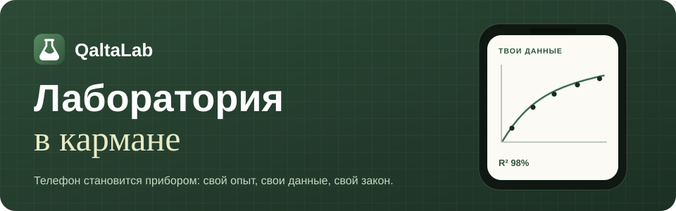

## Кратко

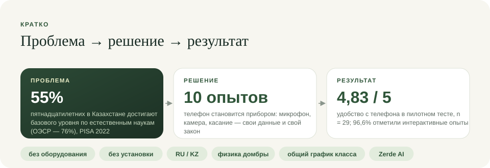

- **Проблема.** Базового уровня по естественным наукам в Казахстане достигают только **55%** пятнадцатилетних, в среднем по ОЭСР — **76%**. Науку учат как формулу на доске.
- **Решение.** QaltaLab превращает обычный телефон в прибор: микрофон, камера и касания измеряют настоящий опыт, а школьник сам выводит закон по **своим** точкам.
- **Чем новое.** Рисунок-предсказание до опыта против своих данных, «Физика домбры» с законом струны и общий график класса по QR-коду.
- **Результат.** Пилотный тест, **n = 29**: удобство с телефона **4,83 / 5**, интерактивные опыты отметили **96,6%**.
- **Где.** В браузере, без установки и аккаунта, на русском и казахском: [qaltalab.site](https://qaltalab.site).

## Попробовать за минуту

| Что | Ссылка |
|---|---|
| Опыт за 2 минуты — нужен только экран | [qaltalab.site/#/lab/timing](https://qaltalab.site/#/lab/timing) |
| Физика домбры — главный опыт | [qaltalab.site/#/lab/dombra](https://qaltalab.site/#/lab/dombra) |
| Готовый результат с рисунком-предсказанием — без датчиков | [qaltalab.site/#/demo/pendulum](https://qaltalab.site/#/demo/pendulum) |
| Общий график класса — пример экрана для проектора | [qaltalab.site/#/class/demo](https://qaltalab.site/#/class/demo) |
| Лист для урока — для учителя | [qaltalab.site/#/lesson/dombra](https://qaltalab.site/#/lesson/dombra) |
| Все 10 опытов | [qaltalab.site](https://qaltalab.site) |

<table>
<tr>
<td align="center">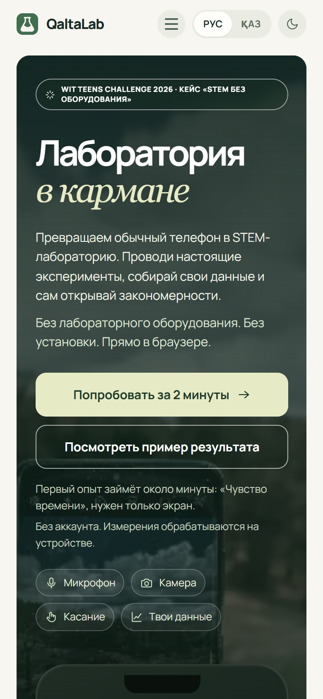<br><sub>Главная</sub></td>
<td align="center">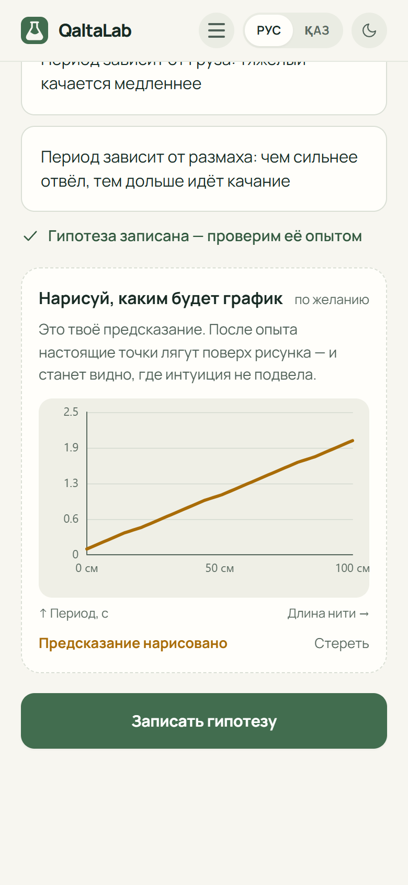<br><sub>Рисунок до опыта</sub></td>
<td align="center">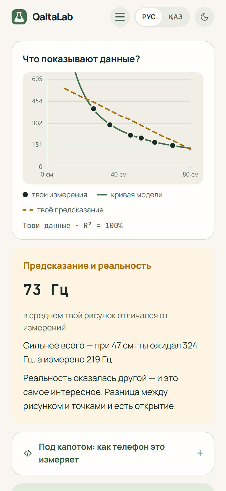<br><sub>Предсказание и реальность</sub></td>
<td align="center">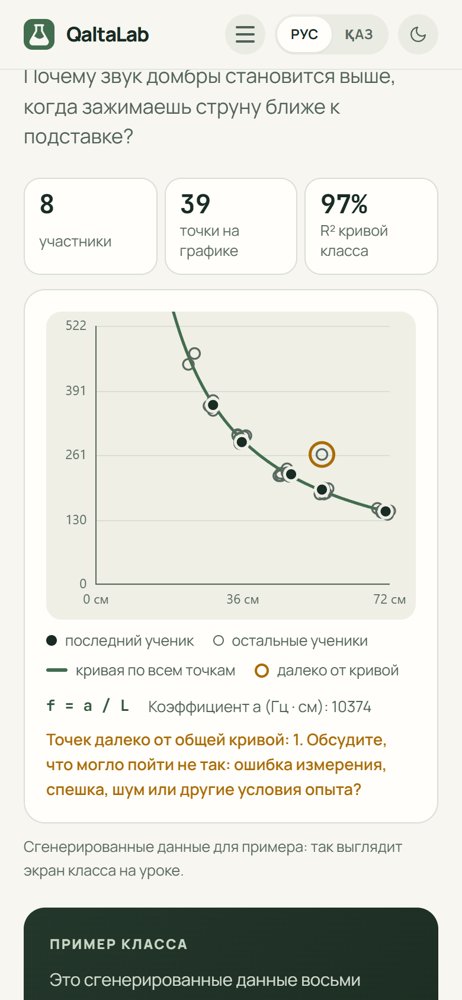<br><sub>Общий график класса</sub></td>
</tr>
</table>

## Проблема

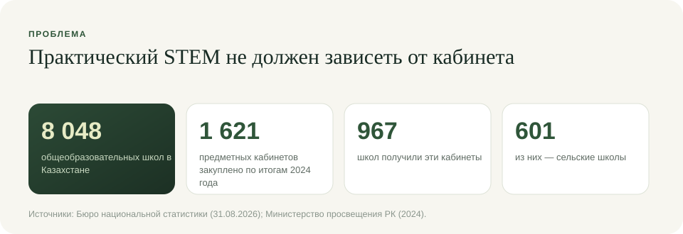

В Казахстане **8 048** общеобразовательных школ ([Бюро национальной статистики, 31.08.2026](https://stat.gov.kz/ru/news/bolee-8-tysyach-shkol-kazakhstana-nachali-novyy-uchebnyy-god/)). По итогам **2024** года закуплено **1 621** современный предметный кабинет для **967** школ: **601** сельская и **366** городских ([Министерство просвещения РК](https://www.gov.kz/memleket/entities/edu/documents/details/836066)). Оснащение идёт, но кабинет есть не всегда и не у каждого — особенно дома, когда хочется попробовать самому.

По данным PISA 2022, базового уровня по естественным наукам в Казахстане достигают только **55%** пятнадцатилетних — в среднем по странам ОЭСР **76%** ([ОЭСР, PISA 2022](https://www.oecd.org/en/publications/pisa-2022-results-volume-i-and-ii-country-notes_ed6fbcc5-en/kazakhstan_8c403c04-en.html)). Почти каждый второй школьник знает науку как формулу на доске, а не как то, что можно измерить самому.

## Решение

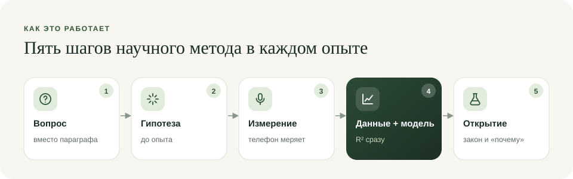

Каждый опыт идёт по пяти шагам научного метода: вопрос → гипотеза → измерение → график → открытие. Формулы на экране нет: ученик двигает ползунки, пока кривая не ляжет на его точки, а `R²` честно показывает, насколько модель описывает данные — даже когда результат слабый. На экране результата — что ты обнаружил, почему так произошло, сам закон и новый вопрос «а если попробовать иначе?».

## Новизна: нарисуй предсказание

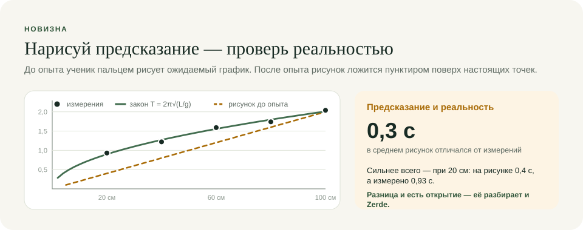

До измерения ученик пальцем рисует, каким ожидает график. После опыта рисунок ложится пунктиром поверх настоящих точек, а карточка «Предсказание и реальность» показывает средний промах и место, где интуиция ошиблась сильнее всего. Это метод «Предскажи — проверь — объясни» (White & Gunstone, 1992), только не словами, а формой кривой. Разницу между рисунком и данными разбирает и Zerde AI.

## Физика домбры

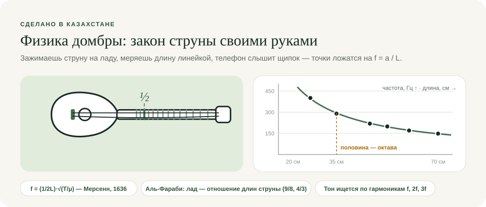

Опыт, сделанный для школ Казахстана. Ученик зажимает струну на разных ладах, линейкой меряет длину звучащей части, а телефон слушает щипок и находит основной тон **по гармоникам** `f`, `2f`, `3f`: у щипка второй обертон часто громче основного тона, и простой поиск самого громкого пика ошибся бы на октаву. Точки ложатся на гиперболу `f = a / L` — струна вдвое короче звучит на октаву выше. Это закон Мерсенна (1636), а лады как отношения длин струны описывал ещё Аль-Фараби в «Большой книге о музыке». Нет домбры — подойдёт гитара или натянутая резинка.

## Десять опытов

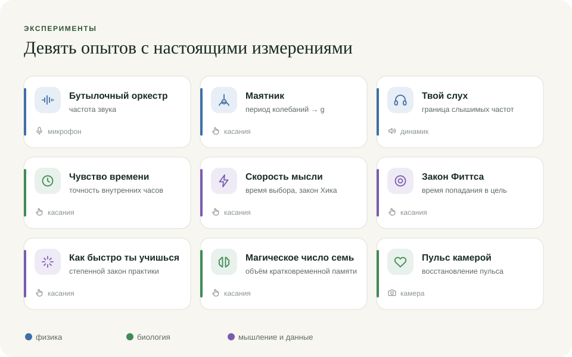

| Опыт | Что измеряешь | Что нужно | Время |
|---|---|---|---|
| **Физика домбры** | частоту струны при разной длине — закон струны и октава | домбра или гитара, линейка, микрофон | ≈6 мин |
| Бутылочный оркестр | частоту звука при разном уровне воды | бутылка, вода, микрофон | ≈5 мин |
| Маятник | период колебаний и ускорение *g* | нитка и небольшой груз | ≈5 мин |
| Твой слух | верхнюю границу слышимых частот | динамик | ≈2 мин |
| Чувство времени | точность внутренних часов | только экран | ≈1 мин |
| Скорость мысли | время выбора — закон Хика | только экран | ≈3 мин |
| Закон Фиттса | время попадания в цель | только экран | ≈2 мин |
| Как быстро ты учишься | степенной закон практики | только экран | ≈4 мин |
| Магическое число семь | объём кратковременной памяти | только экран | ≈4 мин |
| Пульс камерой | восстановление пульса после нагрузки | камера и вспышка | ≈3 мин |

## Общий график класса

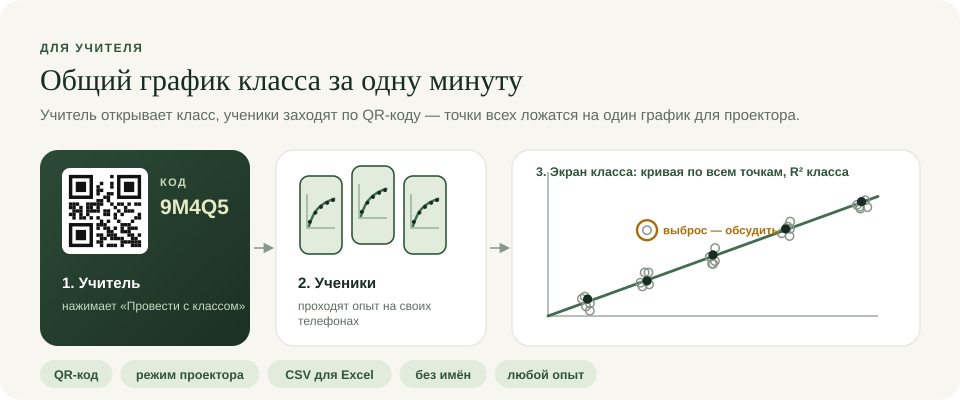

Работает с любым опытом. Учитель нажимает «Провести с классом» и получает код, QR-код и короткую ссылку `qaltalab.site/c/КОД`. Ученики проходят опыт на своих телефонах, а на экране класса для проектора точки всех учеников ложатся на один график; кривую по всем точкам сайт подбирает сам. Точки далеко от общей кривой подсвечиваются — повод обсудить ошибки измерения. Данные класса скачиваются в CSV для Excel. Имён нет: хранятся только код класса, id опыта и числа точек.

## Чем QaltaLab отличается

| | Учебник | Сенсорный инструмент | **QaltaLab** |
|---|:---:|:---:|:---:|
| Реальные измерения | — | ✓ | **✓** |
| Гипотеза до опыта | — | — | **✓** |
| Рисунок-предсказание против своих данных | — | — | **✓** |
| График своих данных | — | ✓ | **✓** |
| Ведёт от вопроса к выводу | — | частично | **✓** |
| Русский и казахский | зависит | зависит | **✓** |
| Работает в браузере | ✓ | зависит | **✓** |
| Общий график класса по QR-коду | — | — | **✓** |
| Разбор результата с AI | — | — | **✓** |

Сравниваются подходы, а не конкретные продукты. [phyphox](https://phyphox.org) (RWTH Aachen University) показывает, насколько мощным научным прибором может быть смартфон. QaltaLab решает другую задачу: провести школьника от вопроса и гипотезы до собственного вывода — прямо в браузере и на русском или казахском.

## Пилотное тестирование


Анкета после опыта, **n = 29**. Это самооценка участников, а не исследование успеваемости; возраст анкета не фиксировала.

| Вопрос | Ответы |
|---|---|
| Удобство с телефона | **4,83 / 5** · 5 из 5 — 24/29 (82,8%) · 4 или 5 — 29/29 |
| Общая оценка | **4,79 / 5** · 5 из 5 — 23/29 (79,3%) · 4 или 5 — 29/29 |
| Формат «попробуй сам — сразу увидь результат» помогает понимать STEM | «да» 21/29 (72,4%) · «скорее да» 8/29 (27,6%) · вместе **100%** |
| Хотели бы использовать на уроках или дома | «да» 22/29 (**75,9%**) · «возможно» 7/29 (24,1%) · «нет» 0 |
| Поняли, что такое QaltaLab, с первого раза | «да» 22/29 (75,9%) · «частично» 7/29 (24,1%) · «нет» 0 |
| Понравились интерактивные эксперименты | 28/29 (**96,6%**) |

**Что мы изменили по итогам.** 24,1% участников поняли продукт с первого раза только частично, поэтому первый экран переписан: сразу видно, что телефон становится прибором, а ученик получает собственные данные. Открытый комментарий оставили 9 человек: 8 — положительные, один предложил добавить больше игровых элементов.

## Технологии

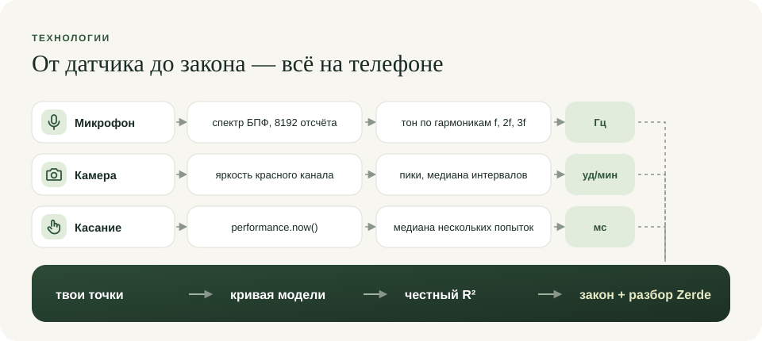


| Что выбрали | Почему |
|---|---|
| Чистый JavaScript без фреймворков | весь код — около 160 КБ при загрузке: сайт быстро открывается на слабом школьном телефоне |
| Датчики через API браузера | `getUserMedia` и Web Audio: ничего не нужно устанавливать, опыт открывается по ссылке |
| Обработка сигнала на устройстве | БПФ, поиск тона по гармоникам, медианы против случайных промахов; сырой звук и видео не покидают телефон |
| Подгонка модели и честный `R²` | ученик сам двигает параметры; на экране класса кривая подбирается автоматически, выбросы ищутся по медиане отклонений |
| Zerde AI на открытых моделях (Groq) | на сервер уходят только числа опыта и рисунок-предсказание; ответ за секунды, ключ хранится на сервере |
| Supabase для общего графика класса | таблицы закрыты, запись и чтение — только через функции с проверкой ввода и лимитами |
| Vercel и GitHub | постоянная ссылка и HTTPS — без него браузер не даст доступ к микрофону и камере; код открыт |

В каждом опыте есть блок «Под капотом» — путь от датчика до точки на графике. В «Бутылочном оркестре» и «Физике домбры» виден живой спектр звука с отметкой найденного тона. QR-код на экране класса сделан собственным генератором, без сторонних библиотек.

**Zerde AI** — наставник внутри опыта. Кнопка «Разобрать мой результат» отправляет числа этого опыта и получает разбор из четырёх частей: что ты обнаружил, почему так произошло, что говорят твои данные (включая сравнение с рисунком-предсказанием), что попробовать дальше. Слабые данные Zerde так и называет слабыми. В правом нижнем углу есть чат, который отвечает только про опыты QaltaLab и научный метод.

## Качество

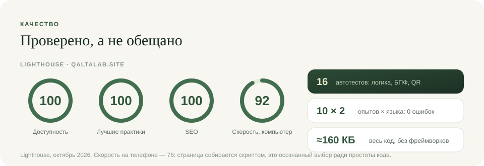

- **16** автотестов: логика опытов, поиск тона по гармоникам, рисунок-предсказание, автоподгонка, QR-код, выбросы.
- Сквозная проверка в браузере: все 10 опытов от вопроса до сравнения серий, на двух языках, на телефоне и компьютере, в светлой и тёмной теме — **0** ошибок в консоли.
- Скрипт сверяет каждую цифру этого README с единым файлом фактов сайта (`js/facts.js`).

## Архитектура и приватность

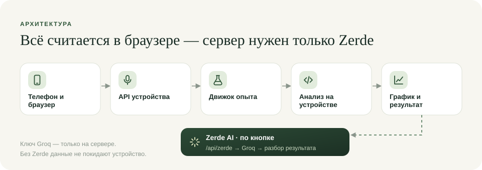

- Измерения и подгонка модели выполняются в браузере. Без Zerde и без класса данные не покидают устройство.
- При разборе результата на `/api/zerde` уходят числа опыта: точки, `R²`, параметры модели, итог гипотезы и значения рисунка-предсказания в тех же точках. В чате — вопрос, до шести последних сообщений и числовой контекст открытого опыта.
- В общем графике класса на `/api/class` уходят только код класса, id опыта и числа точек.
- Ключи хранятся только в переменных окружения сервера. Сервер проверяет формат, ограничивает размер и частоту запросов. Имён и аккаунтов нет.

## Масштаб и развитие

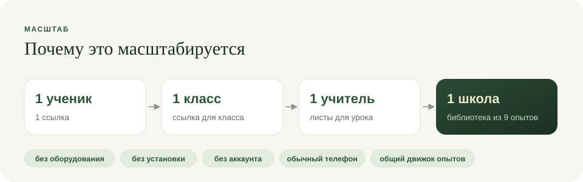

Каждый шаг распространения почти ничего не стоит: учитель показывает QR-код или отправляет ссылку, ученики открывают опыт на своих телефонах, к каждому опыту есть лист для урока. Новый опыт добавляется одним файлом поверх общего движка. Внедрения в школах пока нет: это механизм роста, а не отчёт о нём.

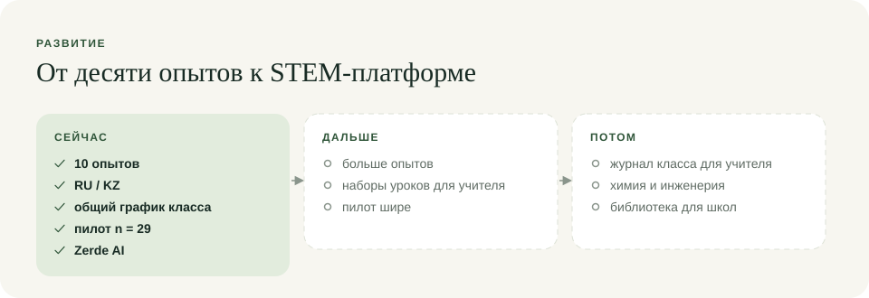

## Для жюри: критерии → продукт

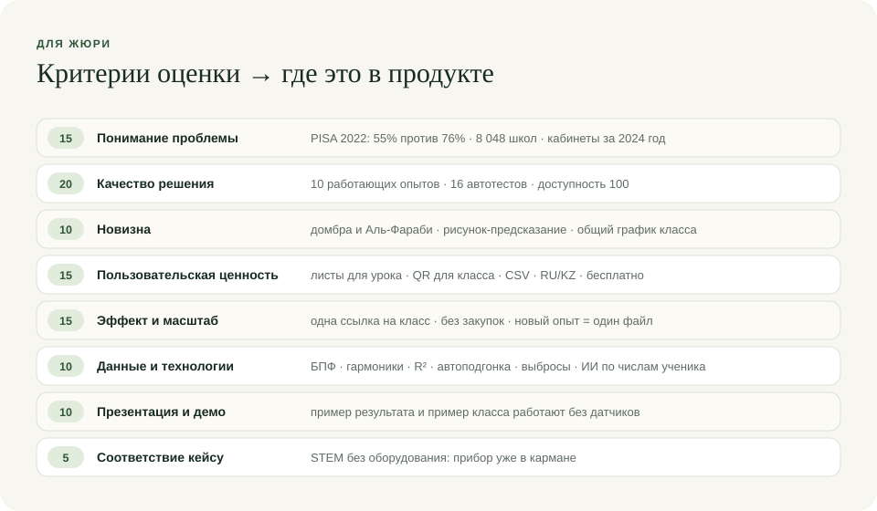

| Что просит кейс | Как это сделано |
|---|---|
| Интерактивность | ползунки модели, `R²` пересчитывается сразу; рисунок-предсказание пальцем |
| Доступность | браузер, без установки и аккаунта, RU и KZ, вход по QR-коду |
| Обучение через эксперимент | свои измерения телефоном в каждом опыте |
| Можно ошибаться | гипотеза и рисунок до опыта, честный разбор, если они не подтвердились |
| Менять параметры | «А если попробовать иначе?» — повтор в новых условиях поверх прежних точек |
| Сразу видеть результат | график, закон и «Предсказание и реальность» на экране результата |

## Научная основа

| На что опираемся | Источник |
|---|---|
| Активное обучение эффективнее лекции, хотя ученику кажется наоборот | Deslauriers et al., PNAS, 2019 — [doi:10.1073/pnas.1821936116](https://doi.org/10.1073/pnas.1821936116) |
| Активное обучение улучшает результаты в STEM, метаанализ 225 работ | Freeman et al., PNAS, 2014 — [doi:10.1073/pnas.1319030111](https://doi.org/10.1073/pnas.1319030111) |
| «Предскажи — проверь — объясни»: гипотеза до опыта | White & Gunstone, 1992 — [doi:10.4324/9780203761342](https://doi.org/10.4324/9780203761342) |
| Смартфон как школьный измерительный прибор | phyphox, RWTH Aachen — [phyphox.org](https://phyphox.org) |
| Закон Хика | Hick, 1952 — [doi:10.1080/17470215208416600](https://doi.org/10.1080/17470215208416600); Hyman, 1953 — [doi:10.1037/h0056940](https://doi.org/10.1037/h0056940) |
| Закон Фиттса | Fitts, 1954 — [doi:10.1037/h0055392](https://doi.org/10.1037/h0055392) |
| «Магическое число семь» | Miller, 1956 — [doi:10.1037/h0043158](https://doi.org/10.1037/h0043158) |

## Ограничения

- Результат зависит от устройства: микрофона, динамика, камеры, экрана, а также от шума и освещения. Поэтому QaltaLab показывает `R²` и честно говорит, когда данных мало.
- «Твой слух» и «Пульс камерой» — образовательные опыты, **не медицинская диагностика**.
- Нужен интернет; разрешения на камеру и микрофон во встроенных браузерах мессенджеров часто отключены.
- Пилотная выборка небольшая (n = 29).

## Команда

| Участник | Роль |
|---|---|
| **Леонова Амелия** | капитан команды, презентация проекта |
| **Идрисов Таир** | автор и единственный разработчик сайта: весь код, дизайн, опыты, сервер и выкладка |
| **Омар Дамир** | участник команды |
| **Шарипов Арлан** | аналитик данных, пилотный опрос |
| **Аманжан Мади** | видеопрезентация и монтаж |

Лицензия [MIT](LICENSE). Фото на главной: Sorin Gheorghita, [Unsplash License](https://unsplash.com/license).

---

<a id="қазақша"></a>

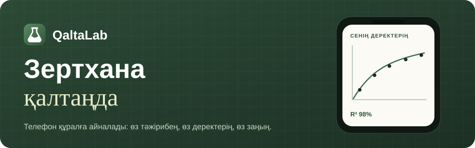

## Қысқаша

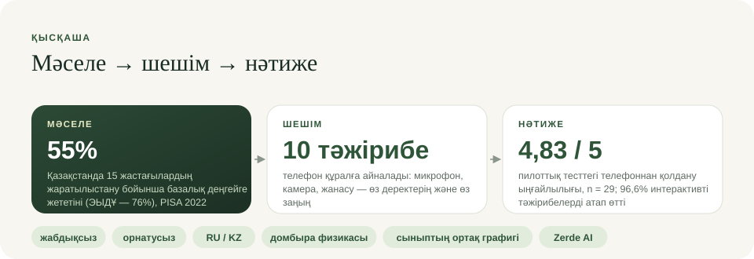

- **Мәселе.** Қазақстанда жаратылыстану ғылымдары бойынша базалық деңгейге он бес жастағылардың тек **55%**-ы жетеді, ЭЫДҰ бойынша орта есеппен — **76%**. Ғылымды тақтадағы формула ретінде оқытады.
- **Шешім.** QaltaLab қарапайым телефонды құралға айналдырады: микрофон, камера және жанасу нақты тәжірибені өлшейді, ал оқушы заңды **өз** нүктелері бойынша өзі шығарады.
- **Жаңалығы.** Тәжірибеге дейінгі сурет-болжауды өз деректеріңмен салыстыру, ішек заңы бар «Домбыра физикасы» және QR-код арқылы сыныптың ортақ графигі.
- **Нәтиже.** Пилоттық тест, **n = 29**: телефоннан қолдану ыңғайлылығы **4,83 / 5**, интерактивті тәжірибелерді **96,6%** атап өтті.
- **Қайда.** Браузерде, орнатусыз және аккаунтсыз, орыс және қазақ тілдерінде: [qaltalab.site](https://qaltalab.site).

## Бір минутта байқап көру

| Не | Сілтеме |
|---|---|
| 2 минуттық тәжірибе — тек экран керек | [qaltalab.site/#/lab/timing](https://qaltalab.site/#/lab/timing) |
| Домбыра физикасы — басты тәжірибе | [qaltalab.site/#/lab/dombra](https://qaltalab.site/#/lab/dombra) |
| Сурет-болжауы бар дайын нәтиже — датчиксіз | [qaltalab.site/#/demo/pendulum](https://qaltalab.site/#/demo/pendulum) |
| Сыныптың ортақ графигі — проекторға арналған экран мысалы | [qaltalab.site/#/class/demo](https://qaltalab.site/#/class/demo) |
| Сабаққа арналған парақ — мұғалімге | [qaltalab.site/#/lesson/dombra](https://qaltalab.site/#/lesson/dombra) |
| Барлық 10 тәжірибе | [qaltalab.site](https://qaltalab.site) |

<table>
<tr>
<td align="center"><br><sub>Басты бет</sub></td>
<td align="center"><br><sub>Тәжірибеге дейінгі сурет</sub></td>
<td align="center"><br><sub>Болжау және шындық</sub></td>
<td align="center"><br><sub>Сыныптың ортақ графигі</sub></td>
</tr>
</table>

## Мәселе

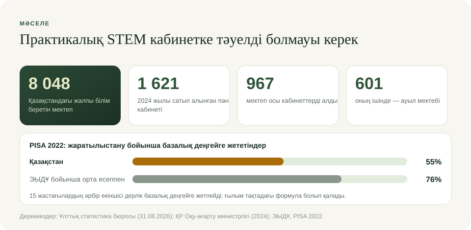

Қазақстанда **8 048** жалпы білім беретін мектеп бар ([Ұлттық статистика бюросы, 31.08.2026](https://stat.gov.kz/ru/news/bolee-8-tysyach-shkol-kazakhstana-nachali-novyy-uchebnyy-god/)). **2024** жылдың қорытындысы бойынша **967** мектепке **1 621** заманауи пән кабинеті сатып алынды: оның **601**-і ауыл мектебі, **366**-сы қала мектебі ([ҚР Оқу-ағарту министрлігі](https://www.gov.kz/memleket/entities/edu/documents/details/836066)). Жабдықтау жүріп жатыр, бірақ кабинет әрдайым және әркімде бола бермейді — әсіресе үйде, бір нәрсені өзің байқап көргің келгенде.

PISA 2022 деректері бойынша Қазақстанда жаратылыстану ғылымдары бойынша базалық деңгейге он бес жастағылардың тек **55%**-ы жетеді — ЭЫДҰ елдерінде орта есеппен **76%** ([ЭЫДҰ, PISA 2022](https://www.oecd.org/en/publications/pisa-2022-results-volume-i-and-ii-country-notes_ed6fbcc5-en/kazakhstan_8c403c04-en.html)). Әрбір екінші дерлік оқушы ғылымды өзі өлшей алатын нәрсе ретінде емес, тақтадағы формула ретінде біледі.

## Шешім


Әр тәжірибе ғылыми әдістің бес қадамынан өтеді: сұрақ → болжам → өлшеу → график → жаңалық. Экранда формула жоқ: оқушы қисық нүктелеріне түскенше жүгірткілерді жылжытады, ал `R²` модельдің деректерді қаншалықты сипаттайтынын ашық көрсетеді — нәтиже әлсіз болса да. Нәтиже экранында — сен не таптың, неге олай болды, заңның өзі және «басқаша жасап көрсе ше?» деген жаңа сұрақ.

## Жаңалық: болжауды сал

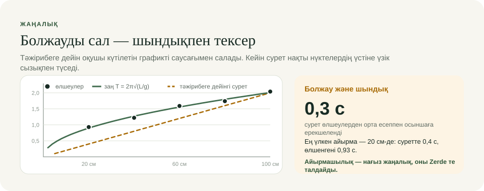

Өлшеуге дейін оқушы графиктің қандай болатынын саусағымен салады. Тәжірибеден кейін сурет нақты нүктелердің үстіне үзік сызықпен түседі, ал «Болжау және шындық» карточкасы орташа айырманы және түйсік ең көп қателескен жерді көрсетеді. Бұл — «Болжа — тексер — түсіндір» әдісі (White & Gunstone, 1992), тек сөзбен емес, қисықтың пішінімен. Сурет пен деректердің айырмасын Zerde AI да талдайды.

## Домбыра физикасы

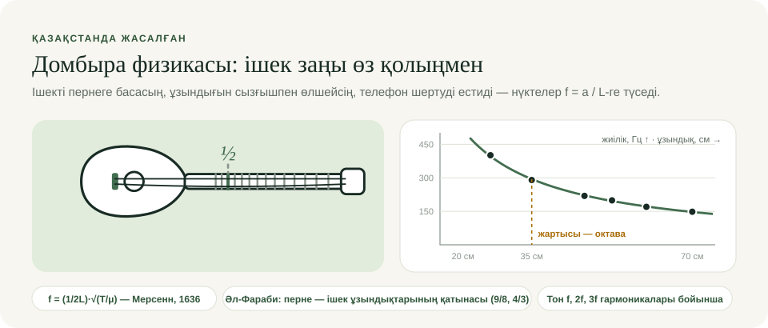

Қазақстан мектептері үшін жасалған тәжірибе. Оқушы ішекті әртүрлі пернелерде басып, дыбысталатын бөліктің ұзындығын сызғышпен өлшейді, ал телефон шертуді тыңдап, негізгі тонды `f`, `2f`, `3f` **гармоникалары бойынша** табады: шертуде екінші обертон жиі негізгі тоннан қаттырақ, ал ең қатты шыңды жай іздеу октаваға қателесер еді. Нүктелер `f = a / L` гиперболасына түседі — екі есе қысқа ішек бір октава жоғары дыбыстайды. Бұл — Мерсенн заңы (1636), ал пернелерді ішек ұзындықтарының қатынасы ретінде Әл-Фараби «Музыканың ұлы кітабында» сипаттаған. Домбыра болмаса — гитара не тартылған резеңке жарайды.

## Он тәжірибе

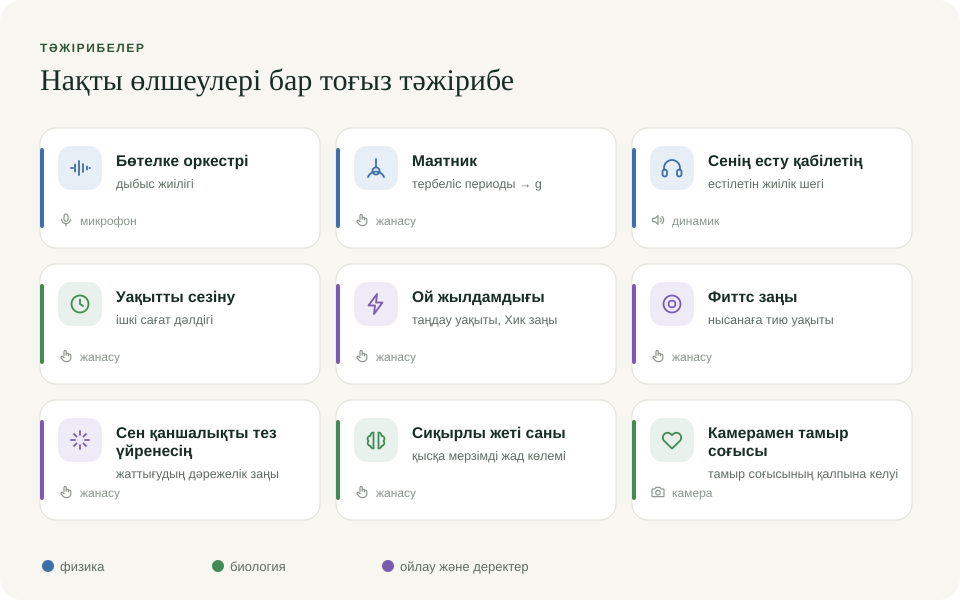

| Тәжірибе | Не өлшейсің | Не керек | Уақыты |
|---|---|---|---|
| **Домбыра физикасы** | әртүрлі ұзындықтағы ішек жиілігі — ішек заңы және октава | домбыра не гитара, сызғыш, микрофон | ≈6 мин |
| Бөтелке оркестрі | әртүрлі су деңгейіндегі дыбыс жиілігі | бөтелке, су, микрофон | ≈5 мин |
| Маятник | тербеліс периоды және *g* үдеуі | жіп және шағын жүк | ≈5 мин |
| Сенің есту қабілетің | естілетін жиіліктердің жоғарғы шекарасы | динамик | ≈2 мин |
| Уақытты сезіну | ішкі сағаттың дәлдігі | тек экран | ≈1 мин |
| Ой жылдамдығы | таңдау уақыты — Хик заңы | тек экран | ≈3 мин |
| Фиттс заңы | нысанаға тию уақыты | тек экран | ≈2 мин |
| Сен қаншалықты тез үйренесің | жаттығудың дәрежелік заңы | тек экран | ≈4 мин |
| Сиқырлы жеті саны | қысқа мерзімді жад көлемі | тек экран | ≈4 мин |
| Камерамен тамыр соғысы | жүктемеден кейін тамыр соғысының қалпына келуі | камера және жарқыл | ≈3 мин |

## Сыныптың ортақ графигі

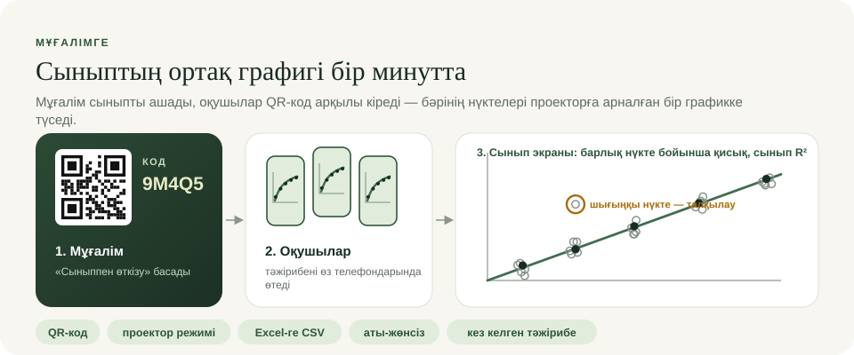

Кез келген тәжірибемен жұмыс істейді. Мұғалім «Сыныппен өткізу» батырмасын басып, код, QR-код және `qaltalab.site/c/КОД` қысқа сілтемесін алады. Оқушылар тәжірибені өз телефондарында өтеді, ал проекторға арналған сынып экранында барлық оқушының нүктелері бір графикке түседі; барлық нүкте бойынша қисықты сайт өзі таңдайды. Ортақ қисықтан алыс нүктелер белгіленеді — өлшеу қателерін талқылауға себеп. Сынып деректері Excel үшін CSV-ге жүктеледі. Аты-жөн сақталмайды: тек сынып коды, тәжірибе id-і және нүктелер сандары.

## QaltaLab неге өзгеше

| | Оқулық | Датчик-құрал | **QaltaLab** |
|---|:---:|:---:|:---:|
| Нақты өлшеулер | — | ✓ | **✓** |
| Тәжірибеге дейінгі болжам | — | — | **✓** |
| Сурет-болжауды өз деректеріңмен салыстыру | — | — | **✓** |
| Өз деректерің графигі | — | ✓ | **✓** |
| Сұрақтан қорытындыға дейін жетелейді | — | ішінара | **✓** |
| Орысша және қазақша | әртүрлі | әртүрлі | **✓** |
| Браузерде жұмыс істейді | ✓ | әртүрлі | **✓** |
| QR-код арқылы сыныптың ортақ графигі | — | — | **✓** |
| Нәтижені AI-мен талдау | — | — | **✓** |

Нақты өнімдер емес, тәсілдер салыстырылады. [phyphox](https://phyphox.org) (RWTH Aachen University) смартфонның қаншалықты қуатты ғылыми құрал бола алатынын көрсетеді. QaltaLab басқа міндетті шешеді: оқушыны сұрақ пен болжамнан өз қорытындысына дейін жеткізу — тікелей браузерде, орыс не қазақ тілінде.

## Пилоттық тестілеу


Тәжірибеден кейінгі сауалнама, **n = 29**. Бұл — үлгерімді зерттеу емес, қатысушылардың өз бағасы; сауалнама жасты тіркеген жоқ.

| Сұрақ | Жауаптар |
|---|---|
| Телефоннан қолдану ыңғайлылығы | **4,83 / 5** · 5 балл — 24/29 (82,8%) · 4 не 5 — 29/29 |
| Жалпы баға | **4,79 / 5** · 5 балл — 23/29 (79,3%) · 4 не 5 — 29/29 |
| «Өзің жасап көр — нәтижесін бірден көр» форматы STEM-ді түсінуге көмектеседі | «иә» 21/29 (72,4%) · «иә болар» 8/29 (27,6%) · барлығы **100%** |
| Сабақта не үйде қолданғысы келеді | «иә» 22/29 (**75,9%**) · «мүмкін» 7/29 (24,1%) · «жоқ» 0 |
| QaltaLab не екенін бірден түсінді | «иә» 22/29 (75,9%) · «ішінара» 7/29 (24,1%) · «жоқ» 0 |
| Интерактивті тәжірибелер ұнады | 28/29 (**96,6%**) |

**Нәтиже бойынша не өзгерттік.** Қатысушылардың 24,1%-ы өнімді алғаш рет ішінара ғана түсінді, сондықтан бірінші экран қайта жазылды: телефон құралға айналатыны және оқушы өз деректерін алатыны бірден көрінеді. Ашық пікірді 9 адам қалдырды: 8-і — оң, біреуі ойын элементтерін көбейтуді ұсынды.

## Технологиялар

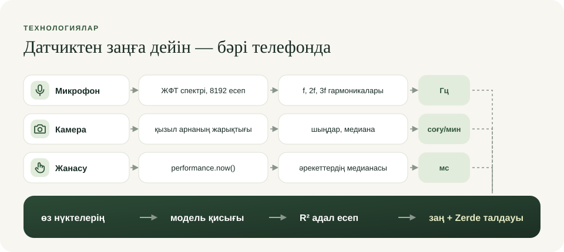


| Не таңдадық | Неге |
|---|---|
| Фреймворксіз таза JavaScript | бүкіл код жүктелгенде шамамен 160 КБ: сайт әлсіз мектеп телефонында тез ашылады |
| Датчиктер браузер API-і арқылы | `getUserMedia` және Web Audio: ештеңе орнатудың қажеті жоқ, тәжірибе сілтеме арқылы ашылады |
| Сигналды құрылғыда өңдеу | ЖФТ, тонды гармоникалар бойынша іздеу, кездейсоқ қателерге қарсы медианалар; шикі дыбыс пен бейне телефоннан шықпайды |
| Модельді сәйкестендіру және адал `R²` | оқушы параметрлерді өзі жылжытады; сынып экранында қисық автоматты таңдалады, шығыңқы нүктелер ауытқулардың медианасы бойынша ізделеді |
| Ашық модельдердегі Zerde AI (Groq) | серверге тек тәжірибе сандары мен сурет-болжау жіберіледі; жауап бірнеше секундта, кілт серверде сақталады |
| Сыныптың ортақ графигіне Supabase | кестелер жабық, жазу мен оқу тек енгізуді тексеретін және шектейтін функциялар арқылы |
| Vercel және GitHub | тұрақты сілтеме және HTTPS — онсыз браузер микрофон мен камераға рұқсат бермейді; код ашық |

Әр тәжірибеде «Ішкі жағы» блогы бар — датчиктен графиктегі нүктеге дейінгі жол. «Бөтелке оркестрі» мен «Домбыра физикасында» дыбыстың тірі спектрі мен табылған тонның белгісі көрінеді. Сынып экранындағы QR-код бөгде кітапханаларсыз, өз генераторымен жасалған.

**Zerde AI** — тәжірибе ішіндегі тәлімгер. «Нәтижемді талдау» батырмасы осы тәжірибенің сандарын жіберіп, төрт бөлімнен тұратын талдау алады: сен не таптың, неге олай болды, деректерің не дейді (сурет-болжаумен салыстыруды қоса), келесіде не байқап көруге болады. Әлсіз деректерді Zerde әлсіз деп атайды. Оң жақ төменгі бұрышта тек QaltaLab тәжірибелері мен ғылыми әдіс туралы жауап беретін чат бар.

## Сапа

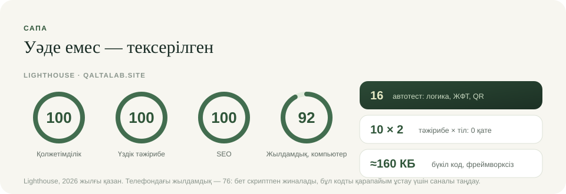

- **16** автотест: тәжірибелер логикасы, тонды гармоникалар бойынша іздеу, сурет-болжау, автосәйкестендіру, QR-код, шығыңқы нүктелер.
- Браузердегі толық тексеру: барлық 10 тәжірибе сұрақтан серияларды салыстыруға дейін, екі тілде, телефон мен компьютерде, ашық және қараңғы тақырыпта — консольде **0** қате.
- Скрипт осы README-дегі әр санды сайттың бірыңғай деректер файлымен (`js/facts.js`) салыстырады.

## Архитектура және құпиялық

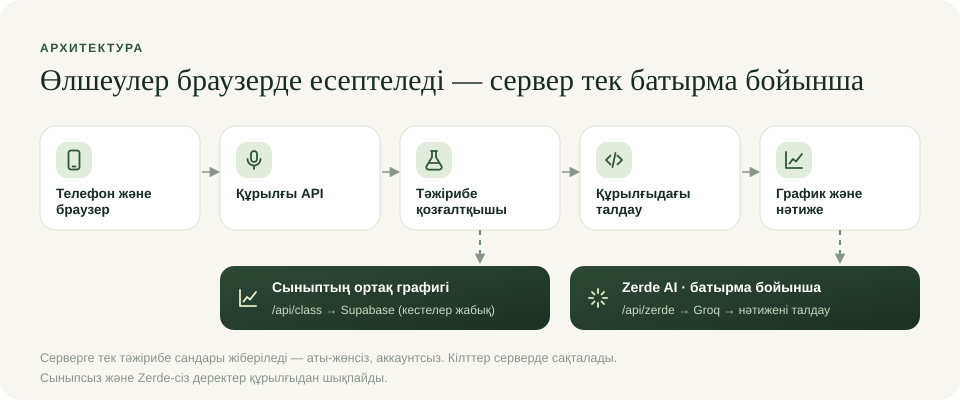

- Өлшеулер мен модельді сәйкестендіру браузерде орындалады. Zerde-сіз және сыныпсыз деректер құрылғыдан шықпайды.
- Нәтижені талдағанда `/api/zerde`-ге тәжірибе сандары жіберіледі: нүктелер, `R²`, модель параметрлері, болжамның қорытындысы және сол нүктелердегі сурет-болжаудың мәндері. Чатта — сұрақ, соңғы алты хабарламаға дейін және ашық тәжірибенің сандық контексті.
- Сыныптың ортақ графигінде `/api/class`-қа тек сынып коды, тәжірибе id-і және нүктелер сандары жіберіледі.
- Кілттер тек сервердің орта айнымалыларында сақталады. Сервер пішімін тексереді, сұраныс көлемі мен жиілігін шектейді. Аты-жөн мен аккаунт жоқ.

## Ауқым және даму

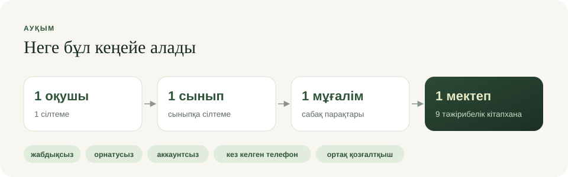

Таратудың әр қадамы дерлік ештеңе тұрмайды: мұғалім QR-кодты көрсетеді не сілтеме жібереді, оқушылар тәжірибені өз телефонында ашады, әр тәжірибеге сабақ парағы бар. Жаңа тәжірибе ортақ қозғалтқыштың үстіне бір файлмен қосылады. Мектептерге енгізу әзірге жоқ: бұл — өсу тетігі, есеп емес.

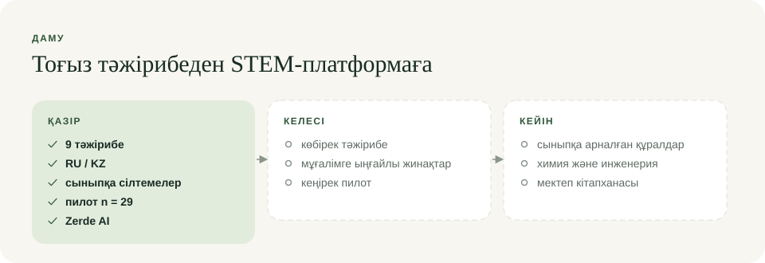

## Қазылар үшін: критерийлер → өнім

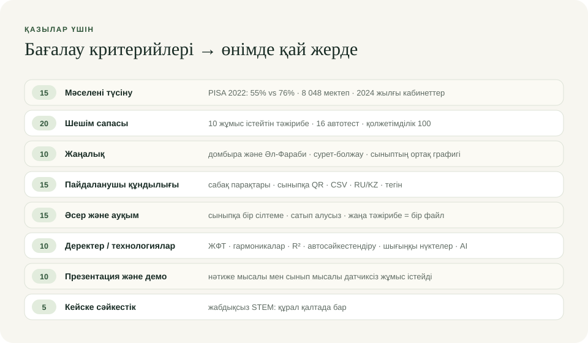

| Кейс не сұрайды | Қалай жасалған |
|---|---|
| Интерактивтілік | модель жүгірткілері, `R²` бірден қайта есептеледі; саусақпен сурет-болжау |
| Қолжетімділік | браузер, орнатусыз және аккаунтсыз, RU және KZ, QR-код арқылы кіру |
| Тәжірибе арқылы оқу | әр тәжірибеде телефонмен өз өлшеулерің |
| Қателесуге болады | тәжірибеге дейінгі болжам мен сурет, расталмаса ашық талдау |
| Параметрлерді өзгерту | «Басқаша жасап көрсе ше?» — бұрынғы нүктелердің үстіне жаңа жағдайда қайталау |
| Нәтижені бірден көру | нәтиже экранындағы график, заң және «Болжау және шындық» |

## Ғылыми негіз

| Неге сүйенеміз | Дереккөз |
|---|---|
| Белсенді оқу дәрістен тиімдірек, бірақ оқушыға керісінше көрінеді | Deslauriers et al., PNAS, 2019 — [doi:10.1073/pnas.1821936116](https://doi.org/10.1073/pnas.1821936116) |
| Белсенді оқу STEM-дегі нәтижелерді жақсартады, 225 жұмыстың метаталдауы | Freeman et al., PNAS, 2014 — [doi:10.1073/pnas.1319030111](https://doi.org/10.1073/pnas.1319030111) |
| «Болжа — тексер — түсіндір»: тәжірибеге дейінгі болжам | White & Gunstone, 1992 — [doi:10.4324/9780203761342](https://doi.org/10.4324/9780203761342) |
| Смартфон — мектептегі өлшеу құралы | phyphox, RWTH Aachen — [phyphox.org](https://phyphox.org) |
| Хик заңы | Hick, 1952 — [doi:10.1080/17470215208416600](https://doi.org/10.1080/17470215208416600); Hyman, 1953 — [doi:10.1037/h0056940](https://doi.org/10.1037/h0056940) |
| Фиттс заңы | Fitts, 1954 — [doi:10.1037/h0055392](https://doi.org/10.1037/h0055392) |
| «Сиқырлы жеті саны» | Miller, 1956 — [doi:10.1037/h0043158](https://doi.org/10.1037/h0043158) |

## Шектеулер

- Нәтиже құрылғыға — микрофонға, динамикке, камераға, экранға — және шу мен жарыққа байланысты. Сондықтан QaltaLab `R²` көрсетеді және деректер аз болса, ашық айтады.
- «Сенің есту қабілетің» мен «Камерамен тамыр соғысы» — білім беру тәжірибелері, **медициналық диагностика емес**.
- Интернет керек; мессенджерлердің ішкі браузерлерінде камера мен микрофонға рұқсат жиі өшірулі.
- Пилоттық іріктеме шағын (n = 29).

## Команда

| Қатысушы | Рөлі |
|---|---|
| **Леонова Амелия** | команда капитаны, жоба презентациясы |
| **Идрисов Таир** | сайттың авторы және жалғыз әзірлеушісі: бүкіл код, дизайн, тәжірибелер, сервер және жариялау |
| **Омар Дамир** | команда мүшесі |
| **Шарипов Арлан** | деректер талдаушысы, пилоттық сауалнама |
| **Аманжан Мади** | бейнепрезентация және монтаж |

Лицензия [MIT](LICENSE). Басты беттегі фото: Sorin Gheorghita, [Unsplash License](https://unsplash.com/license).

---

<details>
<summary>Для разработчиков · Әзірлеушілерге</summary>

Сайт статический, без сборки и зависимостей: HTML, CSS и JavaScript. Серверные функции — `api/zerde.js` (Groq) и `api/class.js` (Supabase) на Vercel; ключи `GROQ_API_KEY`, `SUPABASE_URL`, `SUPABASE_KEY` — в переменных окружения.

```
js/lab.js         движок опыта: пять шагов, результат, PNG и CSV
js/labs/*.js      десять опытов, по файлу на опыт
js/predict.js     рисунок-предсказание и сравнение с данными
js/sound.js       спектр и поиск тона по гармоникам
js/class.js       общий график класса · js/qr.js QR-код без библиотек
js/fit.js         R² и автоподгонка · js/chart.js графики
js/zerde.js       разбор результата · js/zchat.js чат
js/orn.js         казахские орнаментальные мотивы
js/facts.js       все цифры сайта: статистика, PISA, пилотный тест
api/              zerde.js → Groq · class.js → Supabase
tools/            проверка цифр README и сборка инфографики
```

```bash
node --test tests/core.test.mjs     # 16 тестов логики
node tools/check-facts.js           # цифры README совпадают с js/facts.js
node tools/make-readme-assets.js    # пересобрать инфографику
```

</details>
