<div align="center">


# QaltaLab

**Лаборатория в кармане · Зертхана қалтаңда**

Превращаем обычный телефон в инструмент для настоящих STEM-экспериментов.<br>
Қарапайым телефонды нағыз STEM-тәжірибелер құралына айналдырамыз.

[](https://qaltalab.site)
[](#-wit-teens-challenge-2026)
[](#-эксперименты)
[](#)

**[Русский](#русский)** · **[Қазақша](#қазақша)**

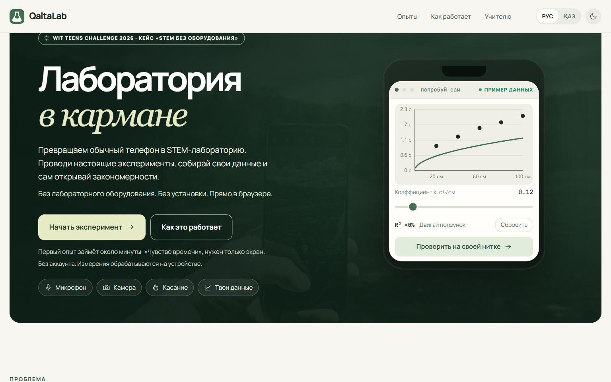

</div>

---

<a id="русский"></a>

# Русский

QaltaLab — сайт, на котором школьник ставит настоящий опыт телефоном, получает **собственные измерения**, сам подбирает к ним модель и открывает закон. Без лабораторного оборудования, без установки и без аккаунта.

## 🎯 Проблема

Не у каждой школы есть лаборатория, оборудование и расходные материалы. Поэтому физику и другие STEM-предметы часто изучают только в теории: формула, готовый пример, один правильный ответ.

- В Казахстане **8 048** общеобразовательных школ — [Бюро национальной статистики, 31.08.2026](https://stat.gov.kz/ru/news/bolee-8-tysyach-shkol-kazakhstana-nachali-novyy-uchebnyy-god/).
- По итогам **2024** года закуплено **1 621** современный предметный кабинет (робототехника, химия, биология, физика, STEM) для **967** школ: **601** сельская и **366** городских — [Министерство просвещения РК](https://www.gov.kz/memleket/entities/edu/documents/details/836066).

Оснащение идёт, но это число за один год, а дома кабинета нет ни у кого — именно тогда, когда ученику хочется попробовать самому.

## 💡 Решение

**Телефон становится лабораторным прибором.** Его микрофон, динамик, камера и сенсорный экран измеряют по-настоящему. Ученик не смотрит заранее подготовленную анимацию: он получает данные своего эксперимента и сам находит зависимость.

## 🔬 Как это работает

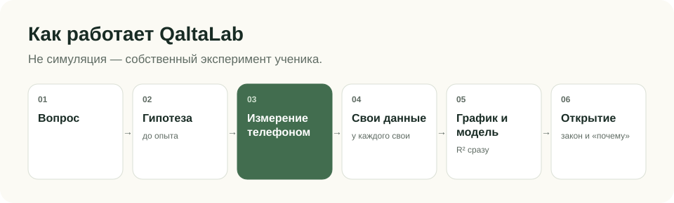

Каждый опыт проходит пять шагов научного метода: вопрос → **гипотеза до опыта** → измерение → **подгонка модели ползунками** (формулы на экране нет, `R²` пересчитывается сразу) → открытие закона. На экране результата: «Что ты обнаружил?» → «Почему так произошло?» → закон → «Попробуй изменить…». Опыт можно повторить в других условиях, и новые точки лягут поверх старых.

У каждого опыта постоянная ссылка, например [qaltalab.site/#/lab/pendulum](https://qaltalab.site/#/lab/pendulum): учитель отправляет её классу, регистрация не нужна. Для каждого опыта есть **лист для урока** ([пример](https://qaltalab.site/#/lesson/pendulum)): цель, план на 45 минут, таблица для данных и вопросы для обсуждения — его можно распечатать. Результат сохраняется картинкой PNG с графиком.

## 🧪 Эксперименты

| Опыт | Область | Что измеряется | Что нужно | Возможность телефона |
|---|---|---|---|---|
| Бутылочный оркестр | физика, акустика | частота тона от высоты воздуха | бутылка и вода | микрофон |
| Маятник | физика, механика | период от длины нити, из него — *g* | нитка и ластик | касания + таймер |
| Твой слух | физика звука, биология | верхняя слышимая частота | — | динамик |
| Чувство времени | биология, восприятие | отмеренное время от заданного | — | касания + таймер |
| Скорость мысли | информатика | время выбора от числа вариантов (закон Хика) | — | касания + таймер |
| Закон Фиттса | информатика, интерфейсы | время попадания от трудности цели | — | касания + таймер |
| Как быстро ты учишься | информатика, когнитивистика | время поиска от номера попытки | — | касания + таймер |
| Магическое число семь | биология, память | точность от длины ряда цифр | — | касания + таймер |
| Пульс камерой | биология, физиология | восстановление пульса после нагрузки | — | камера и вспышка |

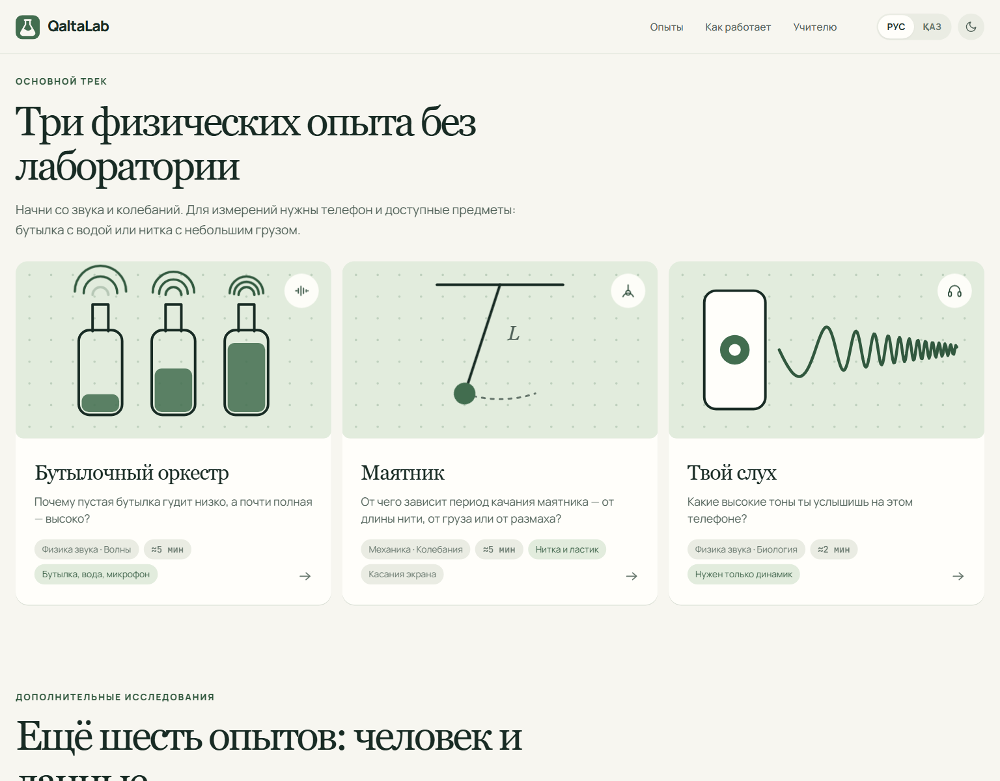

## 📊 Результаты пользовательского тестирования


Пилотное тестирование, **n = 29** (анкета после опыта; возраст участников анкета не фиксировала).

| Показатель | Результат |
|---|---|
| Удобство с телефона | **4,83 / 5**; 5 из 5 поставили 24/29 (82,8%), 4 или 5 — 29/29 (100%) |
| Общая оценка | **4,79 / 5**; 5 из 5 — 23/29 (79,3%), 4 или 5 — 29/29 (100%) |
| Формат «попробуй сам — сразу увидь результат» помогает понимать STEM | «Да» 21/29 (72,4%), «Скорее да» 8/29 (27,6%) — **100%** ответили «Да» или «Скорее да» |
| Хотели бы использовать на уроках или дома | «Да» 22/29 (**75,9%**), «Возможно» 7/29 (24,1%), «Нет» 0 |
| Поняли, что такое QaltaLab | «Да» 22/29 (75,9%), «Частично» 7/29 (24,1%), «Нет» 0 |
| Понравились интерактивные эксперименты | 28/29 (**96,6%**) |

**Что мы изменили по итогам.** 24,1% участников поняли продукт с первого раза только частично. Поэтому первый экран переписан: сразу сказано, что телефон становится прибором, а ученик получает собственные данные, и добавлена цепочка «Телефон → Измерение → Твои данные → График → Закономерность». Из 9 открытых комментариев 8 положительные, один предлагает добавить игровые элементы.

## 📱 Телефон как лаборатория

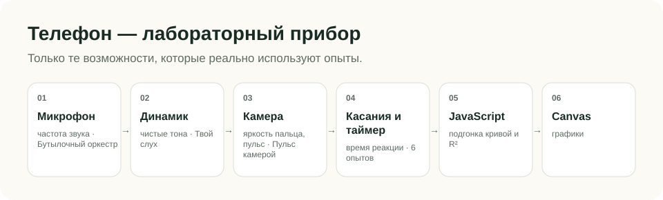

Показаны только возможности, которые опыты используют на самом деле. Акселерометр и магнитометр пока не используются — они в планах.

## 🧠 Zerde AI

Zerde анализирует реальные результаты эксперимента и помогает ученику понять, что показывают именно его данные. Он появляется только на экране результата, запускается кнопкой «Разобрать мой результат» и отвечает четырьмя блоками: что ты обнаружил, почему так произошло, что говорят твои данные, что попробовать дальше. Ещё есть три готовых уточняющих вопроса.

Кроме того, Zerde живёт в **чате в правом нижнем углу** любой страницы: можно спросить, с какого опыта начать, что такое R² или почему твои точки легли именно так. Если открыт опыт, к вопросу прикладываются его числа. Zerde отвечает только про QaltaLab, опыты и научный метод; посторонние темы и попытки сменить ему роль он вежливо отклоняет.

- На сервер уходят только вопрос и числа этого опыта: точки, `R²`, параметры модели и то, подтвердилась ли гипотеза. Имени, аккаунта и истории нет.
- Ключ Groq хранится только в переменных окружения Vercel. В браузер он не попадает.
- Слабые данные Zerde так и называет слабыми и подсказывает, как улучшить опыт.
- Если сервис недоступен, опыт и обычный разбор работают как прежде.

<div align="center">
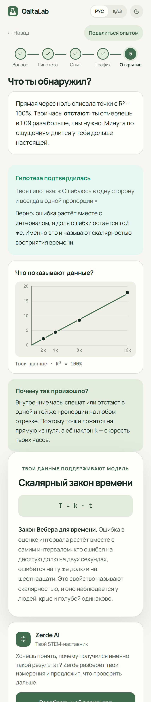&nbsp;&nbsp;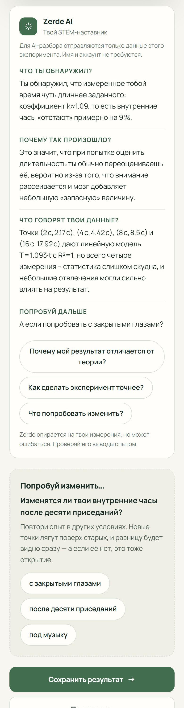
<br><sub>Экран результата и разбор Zerde AI на телефоне. Опыт «Чувство времени» пройден скриптом-проверкой в браузере, поэтому точки легли почти идеально; ответ Zerde — настоящий.</sub>
</div>

## 🏗 Архитектура

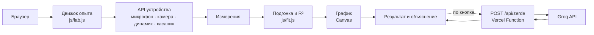

## 🔐 Приватность

- **Без Zerde** измерения обрабатываются на устройстве и никуда не отправляются; прогресс хранится в `localStorage`.
- **С Zerde** на `/api/zerde` уходят только обезличенные числа одного опыта. Сервер проверяет формат, ограничивает размер и частоту запросов и не сохраняет данные.
- Аккаунтов, cookies-трекеров и аналитики нет.

## 🚀 Запуск проекта

Сборка не нужна, зависимостей нет.

```bash
git clone https://github.com/tairidrisov33-cmd/QaltaLab.git
cd QaltaLab
python -m http.server 5173            # сайт: http://localhost:5173
node --test tests/core.test.mjs       # логика опытов
node tools/check-facts.js             # цифры в README совпадают с js/facts.js
node tools/make-readme-assets.js      # пересобрать инфографику
```

Zerde работает только в выкладке на Vercel с переменной окружения `GROQ_API_KEY`. Локально разбор покажет «Zerde сейчас недоступен», а опыт продолжит работать. Микрофону и камере нужен HTTPS или `localhost`.

## 📁 Структура проекта

```
index.html            страница, мета-теги, подключение скриптов
css/style.css         светлая и тёмная темы
js/
  lab.js              движок опыта: 5 шагов, результат, ссылки, экспорт PNG
  labs/*.js           9 опытов, по файлу на опыт
  fit.js · chart.js   R² и графики
  perm.js             объяснение и ошибки разрешений камеры и микрофона
  zerde.js            карточка Zerde AI
  facts.js            все цифры сайта: статистика и пилотный тест
  i18n.js             русский ↔ казахский
  app.js · hero.js    главная страница и мини-опыт
api/zerde.js          серверная функция: проверка данных → Groq
tools/                проверка цифр и сборка инфографики
docs/                 скриншоты и инфографика для README
```

## 🗺 Roadmap

- ✅ **Работает сейчас:** 9 опытов, RU/KZ, ссылки на опыты, экспорт результата, Zerde AI, светлая и тёмная темы.
- 🔄 **Развивается:** точность измерений на разных телефонах, новые варианты «А если иначе?».
- 💡 **Планируется:** больше физики (ускорение, наклон, магнитное поле), химия и инженерия на том же движке, задания для классов, STEM-библиотека для школ.

## 📚 Научная база

| На что опираемся | Источник |
|---|---|
| Активное обучение эффективнее лекции, хотя ученику кажется наоборот | Deslauriers et al., PNAS, 2019 — [doi:10.1073/pnas.1821936116](https://doi.org/10.1073/pnas.1821936116) |
| Активное обучение улучшает результаты в STEM, метаанализ 225 исследований | Freeman et al., PNAS, 2014 — [doi:10.1073/pnas.1319030111](https://doi.org/10.1073/pnas.1319030111) |
| Схема «предскажи — проверь — объясни» | White & Gunstone, *Probing Understanding*, 1992 — [doi:10.4324/9780203761342](https://doi.org/10.4324/9780203761342) |
| Датчики смартфона как школьный прибор | phyphox, RWTH Aachen University — [phyphox.org](https://phyphox.org) |
| Закон Хика | Hick, 1952 — [doi:10.1080/17470215208416600](https://doi.org/10.1080/17470215208416600); Hyman, 1953 — [doi:10.1037/h0056940](https://doi.org/10.1037/h0056940) |
| Закон Фиттса | Fitts, 1954 — [doi:10.1037/h0055392](https://doi.org/10.1037/h0055392) |
| «Магическое число семь» | Miller, 1956 — [doi:10.1037/h0043158](https://doi.org/10.1037/h0043158) |

## ⚠️ Ограничения

- Результаты зависят от устройства: микрофона, динамика, камеры и экрана.
- «Твой слух» — образовательный опыт, **не медицинская диагностика**: динамик не откалиброван, громкость ограничена.
- «Пульс камерой» — образовательное измерение, **не медицинская диагностика**.
- Разрешения браузера на камеру и микрофон ведут себя по-разному; во встроенных браузерах мессенджеров они часто отключены.
- Пилотная выборка небольшая (n = 29), возраст участников не фиксировался.

## 🏆 WIT Teens Challenge 2026

Кейс «STEM без сложного оборудования». QaltaLab отвечает на него прямо: прибор уже есть в кармане. Ученик пробует, ошибается, меняет условия, сразу видит результат на своих данных и сам выводит закономерность.

## 👥 Команда

| | Участник | Роль |
|---|---|---|
| 👑 | **Леонова Амелия** | **Капитан команды.** Презентация проекта и питч |
| 💻 | **Идрисов Таир** | **Создатель и ведущий разработчик.** Идея, архитектура и код сайта QaltaLab — [@tairidrisov33-cmd](https://github.com/tairidrisov33-cmd) |
| 🛠 | **Омар Дамир** | **Разработчик.** Помогает в разработке сайта |
| 📊 | **Шарипов Арлан** | **Аналитик данных.** Статистика и результаты пилотного опроса |
| 🎬 | **Аманжан Мади** | **Видеопрезентация.** Съёмка ролика и монтаж |

## 📄 License

[MIT](LICENSE). Фото на главной: Sorin Gheorghita, [Unsplash License](https://unsplash.com/license).

---

<a id="қазақша"></a>

# Қазақша

QaltaLab — оқушы телефонмен нағыз тәжірибе жасап, **өз өлшеулерін** алатын, оларға модельді өзі таңдап, заңды өзі ашатын сайт. Зертхана жабдығынсыз, орнатусыз және аккаунтсыз.

## 🎯 Мәселе

Әр мектепте зертхана, жабдық және шығын материалдары бола бермейді. Сондықтан физика мен басқа STEM-пәндер көбіне тек теория күйінде қалады: формула, дайын мысал, бір дұрыс жауап.

- Қазақстанда **8 048** жалпы білім беретін мектеп бар — [Ұлттық статистика бюросы, 31.08.2026](https://stat.gov.kz/ru/news/bolee-8-tysyach-shkol-kazakhstana-nachali-novyy-uchebnyy-god/).
- **2024** жылдың қорытындысы бойынша **967** мектепке **1 621** заманауи пән кабинеті сатып алынды (робототехника, химия, биология, физика, STEM): оның **601**-і ауыл мектебі, **366**-сы қала мектебі — [ҚР Оқу-ағарту министрлігі](https://www.gov.kz/memleket/entities/edu/documents/details/836066).

Жабдықтау жүріп жатыр, бірақ бұл бір жылдың саны, ал үйде кабинет ешкімде жоқ — оқушы бір нәрсені өзі байқап көргісі келген дәл сол сәтте.

## 💡 Шешім

**Телефон зертхана құралына айналады.** Оның микрофоны, динамигі, камерасы мен сенсорлы экраны шын өлшейді. Оқушы алдын ала дайындалған анимацияны көрмейді: ол өз тәжірибесінің деректерін алып, тәуелділікті өзі табады.

## 🔬 Қалай жұмыс істейді

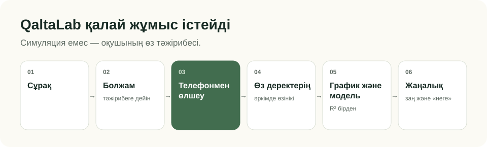

Әр тәжірибе ғылыми әдістің бес қадамынан өтеді: сұрақ → **тәжірибеге дейінгі болжам** → өлшеу → **модельді жүгірткілермен сәйкестендіру** (экранда формула жоқ, `R²` бірден қайта есептеледі) → заңды ашу. Нәтиже экранында: «Сен не таптың?» → «Неге олай болды?» → заң → «Өзгертіп көр…». Тәжірибені басқа жағдайда қайталауға болады, жаңа нүктелер ескілерінің үстіне түседі.

Әр тәжірибенің тұрақты сілтемесі бар, мысалы [qaltalab.site/#/lab/pendulum](https://qaltalab.site/#/lab/pendulum): мұғалім оны сыныпқа жібереді, тіркелу қажет емес. Әр тәжірибеге **сабаққа арналған парақ** бар ([мысал](https://qaltalab.site/#/lesson/pendulum)): мақсат, 45 минуттық жоспар, деректер кестесі және талқылау сұрақтары — оны басып шығаруға болады. Нәтиже графигімен бірге PNG сурет ретінде сақталады.

## 🧪 Тәжірибелер

| Тәжірибе | Сала | Не өлшенеді | Не керек | Телефонның мүмкіндігі |
|---|---|---|---|---|
| Бөтелке оркестрі | физика, акустика | ауа биіктігіне байланысты дыбыс жиілігі | бөтелке мен су | микрофон |
| Маятник | физика, механика | жіп ұзындығына байланысты период, одан — *g* | жіп пен өшіргіш | жанасу + таймер |
| Сенің есту қабілетің | дыбыс физикасы, биология | естілетін ең жоғары жиілік | — | динамик |
| Уақытты сезіну | биология, қабылдау | берілген уақытқа байланысты өлшенген уақыт | — | жанасу + таймер |
| Ой жылдамдығы | информатика | нұсқа санына байланысты таңдау уақыты (Хик заңы) | — | жанасу + таймер |
| Фиттс заңы | информатика, интерфейстер | нысана қиындығына байланысты тию уақыты | — | жанасу + таймер |
| Сен қаншалықты тез үйренесің | информатика, когнитивтік ғылым | әрекет нөміріне байланысты іздеу уақыты | — | жанасу + таймер |
| Сиқырлы жеті саны | биология, жад | цифрлар қатарының ұзындығына байланысты дәлдік | — | жанасу + таймер |
| Камерамен тамыр соғысы | биология, физиология | жүктемеден кейін тамыр соғысының қалпына келуі | — | камера және жарқыл |

## 📊 Пайдаланушылық тест нәтижелері

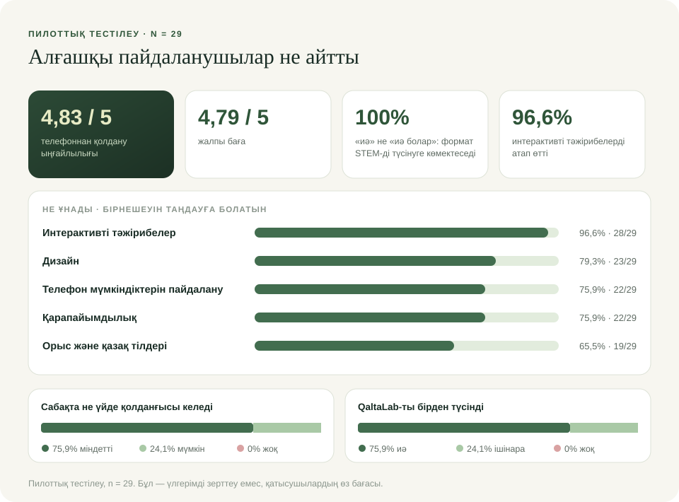

Пилоттық тестілеу, **n = 29** (тәжірибеден кейінгі сауалнама; сауалнама қатысушылардың жасын тіркеген жоқ).

| Көрсеткіш | Нәтиже |
|---|---|
| Телефоннан қолдану ыңғайлылығы | **4,83 / 5**; 5 баллды 24/29 (82,8%) қойды, 4 не 5 — 29/29 (100%) |
| Жалпы баға | **4,79 / 5**; 5 балл — 23/29 (79,3%), 4 не 5 — 29/29 (100%) |
| «Өзің жасап көр — нәтижесін бірден көр» форматы STEM-ді түсінуге көмектеседі | «Иә» 21/29 (72,4%), «Иә болар» 8/29 (27,6%) — **100%** «Иә» не «Иә болар» деп жауап берді |
| Сабақта не үйде қолданғысы келеді | «Иә» 22/29 (**75,9%**), «Мүмкін» 7/29 (24,1%), «Жоқ» 0 |
| QaltaLab не екенін түсінді | «Иә» 22/29 (75,9%), «Ішінара» 7/29 (24,1%), «Жоқ» 0 |
| Интерактивті тәжірибелер ұнады | 28/29 (**96,6%**) |

**Нәтиже бойынша не өзгерттік.** Қатысушылардың 24,1%-ы өнімді алғаш рет ішінара ғана түсінді. Сондықтан бірінші экран қайта жазылды: телефон құралға айналатыны және оқушы өз деректерін алатыны бірден айтылады, әрі «Телефон → Өлшеу → Сенің деректерің → График → Заңдылық» тізбегі қосылды. 9 ашық пікірдің 8-і оң, біреуі ойын элементтерін қосуды ұсынады.

## 📱 Телефон — зертхана құралы

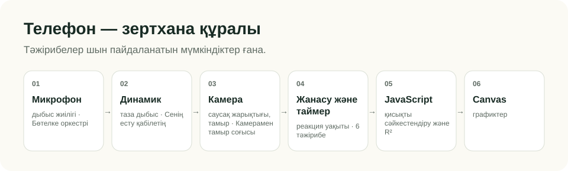

Тәжірибелер шын пайдаланатын мүмкіндіктер ғана көрсетілген. Акселерометр мен магнитометр әзірге қолданылмайды — олар жоспарда.

## 🧠 Zerde AI

Zerde тәжірибенің нақты нәтижелерін талдап, оқушыға дәл өз деректері не көрсететінін түсінуге көмектеседі. Ол тек нәтиже экранында шығады, «Нәтижемді талдау» батырмасымен іске қосылады және төрт бөліммен жауап береді: сен не таптың, неге олай болды, деректерің не дейді, келесіде не байқап көруге болады. Үш дайын нақтылау сұрағы да бар.

Сонымен қатар Zerde кез келген беттің **оң жақ төменгі бұрышындағы чатта** тұрады: қай тәжірибеден бастау керек, R² деген не немесе нүктелерің неге дәл осылай түскенін сұрауға болады. Тәжірибе ашық болса, сұраққа оның сандары қосылады. Zerde тек QaltaLab, тәжірибелер және ғылыми әдіс туралы жауап береді; бөгде тақырыптар мен рөлін өзгерту әрекеттерін сыпайы түрде қабылдамайды.

- Серверге тек сұрақ және осы тәжірибенің сандары жіберіледі: нүктелер, `R²`, модель параметрлері және болжамның расталғаны. Аты-жөн, аккаунт және тарих жоқ.
- Groq кілті тек Vercel-дің орта айнымалыларында сақталады. Ол браузерге түспейді.
- Әлсіз деректерді Zerde әлсіз деп атайды және тәжірибені қалай жақсартуды ұсынады.
- Қызмет қолжетімсіз болса, тәжірибе мен әдеттегі талдау бұрынғыдай жұмыс істейді.

<div align="center">
&nbsp;&nbsp;
<br><sub>Телефондағы нәтиже экраны және Zerde AI талдауы. «Уақытты сезіну» тәжірибесін браузердегі тексеру скрипті өтті, сондықтан нүктелер мінсіз дерлік түсті; Zerde жауабы — нақты.</sub>
</div>

## 🏗 Архитектура

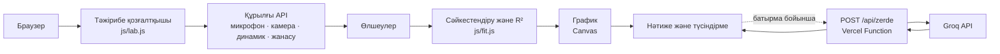

## 🔐 Құпиялық

- **Zerde-сіз** өлшеулер құрылғыда өңделеді және ешқайда жіберілмейді; прогресс `localStorage`-та сақталады.
- **Zerde-мен** `/api/zerde` мекенжайына бір тәжірибенің иесіз сандары ғана жіберіледі. Сервер пішімін тексереді, сұраныс көлемі мен жиілігін шектейді және деректерді сақтамайды.
- Аккаунт, трекер-cookie және аналитика жоқ.

## 🚀 Іске қосу

Құрастыру қажет емес, тәуелділіктер жоқ.

```bash
git clone https://github.com/tairidrisov33-cmd/QaltaLab.git
cd QaltaLab
python -m http.server 5173            # сайт: http://localhost:5173
node --test tests/core.test.mjs       # тәжірибелер логикасы
node tools/check-facts.js             # README-дегі сандар js/facts.js-пен сәйкес
node tools/make-readme-assets.js      # инфографиканы қайта жинау
```

Zerde тек `GROQ_API_KEY` орта айнымалысы бар Vercel-дегі нұсқада жұмыс істейді. Жергілікті іске қосқанда талдау «Zerde қазір қолжетімсіз» деп көрсетеді, ал тәжірибе жұмысын жалғастырады. Микрофон мен камераға HTTPS немесе `localhost` керек.

## 📁 Жоба құрылымы

```
index.html            бет, мета-тегтер, скрипттерді қосу
css/style.css         ашық және қараңғы тақырыптар
js/
  lab.js              тәжірибе қозғалтқышы: 5 қадам, нәтиже, сілтемелер, PNG экспорт
  labs/*.js           9 тәжірибе, әрқайсысына бір файл
  fit.js · chart.js   R² және графиктер
  perm.js             камера мен микрофон рұқсаттарының түсіндірмесі және қателері
  zerde.js            Zerde AI карточкасы
  facts.js            сайттағы барлық сандар: статистика және пилоттық тест
  i18n.js             орысша ↔ қазақша
  app.js · hero.js    басты бет және шағын тәжірибе
api/zerde.js          сервер функциясы: деректерді тексеру → Groq
tools/                сандарды тексеру және инфографика жинау
docs/                 README-ге арналған скриншоттар мен инфографика
```

## 🗺 Даму жоспары

- ✅ **Қазір жұмыс істейді:** 9 тәжірибе, RU/KZ, тәжірибеге сілтемелер, нәтиже экспорты, Zerde AI, ашық және қараңғы тақырыптар.
- 🔄 **Дамып жатыр:** әртүрлі телефондардағы өлшеу дәлдігі, «Басқаша жасап көрсе ше?» жаңа нұсқалары.
- 💡 **Жоспарда:** көбірек физика (үдеу, көлбеу, магнит өрісі), сол қозғалтқышпен химия және инженерия, сыныптарға арналған тапсырмалар, мектептерге арналған STEM-кітапхана.

## 📚 Ғылыми негіз

| Неге сүйенеміз | Дереккөз |
|---|---|
| Белсенді оқу дәрістен тиімдірек, бірақ оқушыға керісінше көрінеді | Deslauriers et al., PNAS, 2019 — [doi:10.1073/pnas.1821936116](https://doi.org/10.1073/pnas.1821936116) |
| Белсенді оқу STEM-дегі нәтижелерді жақсартады, 225 зерттеудің метаталдауы | Freeman et al., PNAS, 2014 — [doi:10.1073/pnas.1319030111](https://doi.org/10.1073/pnas.1319030111) |
| «Болжа — тексер — түсіндір» сызбасы | White & Gunstone, *Probing Understanding*, 1992 — [doi:10.4324/9780203761342](https://doi.org/10.4324/9780203761342) |
| Смартфон датчиктері мектеп құралы ретінде | phyphox, RWTH Aachen University — [phyphox.org](https://phyphox.org) |
| Хик заңы | Hick, 1952 — [doi:10.1080/17470215208416600](https://doi.org/10.1080/17470215208416600); Hyman, 1953 — [doi:10.1037/h0056940](https://doi.org/10.1037/h0056940) |
| Фиттс заңы | Fitts, 1954 — [doi:10.1037/h0055392](https://doi.org/10.1037/h0055392) |
| «Сиқырлы жеті саны» | Miller, 1956 — [doi:10.1037/h0043158](https://doi.org/10.1037/h0043158) |

## ⚠️ Шектеулер

- Нәтижелер құрылғыға байланысты: микрофонға, динамикке, камераға және экранға.
- «Сенің есту қабілетің» — білім беру тәжірибесі, **медициналық диагностика емес**: динамик калибрленбеген, дыбыс қаттылығы шектеулі.
- «Камерамен тамыр соғысы» — білім беру өлшемі, **медициналық диагностика емес**.
- Браузердің камера мен микрофонға рұқсаттары әртүрлі жұмыс істейді; мессенджерлердің ішкі браузерлерінде олар жиі өшірулі.
- Пилоттық іріктеме шағын (n = 29), қатысушылардың жасы тіркелмеген.

## 🏆 WIT Teens Challenge 2026

«Күрделі жабдықсыз STEM» кейсі. QaltaLab оған тікелей жауап береді: құрал қалтада бар. Оқушы байқап көреді, қателеседі, жағдайды өзгертеді, нәтижені өз деректерінен бірден көреді және заңдылықты өзі шығарады.

## 👥 Команда

| | Қатысушы | Рөлі |
|---|---|---|
| 👑 | **Леонова Амелия** | **Команда капитаны.** Жоба презентациясы және питч |
| 💻 | **Идрисов Таир** | **Жобаның авторы және жетекші әзірлеуші.** QaltaLab сайтының идеясы, архитектурасы және коды — [@tairidrisov33-cmd](https://github.com/tairidrisov33-cmd) |
| 🛠 | **Омар Дамир** | **Әзірлеуші.** Сайтты әзірлеуге көмектеседі |
| 📊 | **Шарипов Арлан** | **Деректер талдаушысы.** Статистика және пилоттық сауалнама нәтижелері |
| 🎬 | **Аманжан Мади** | **Бейнепрезентация.** Роликті түсіру және монтаж |

## 📄 License

[MIT](LICENSE). Басты беттегі фото: Sorin Gheorghita, [Unsplash License](https://unsplash.com/license).
