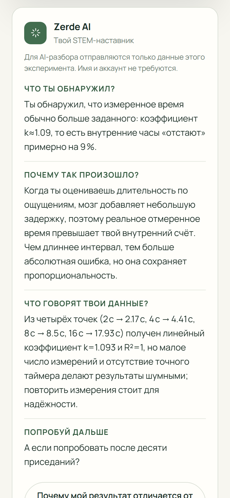
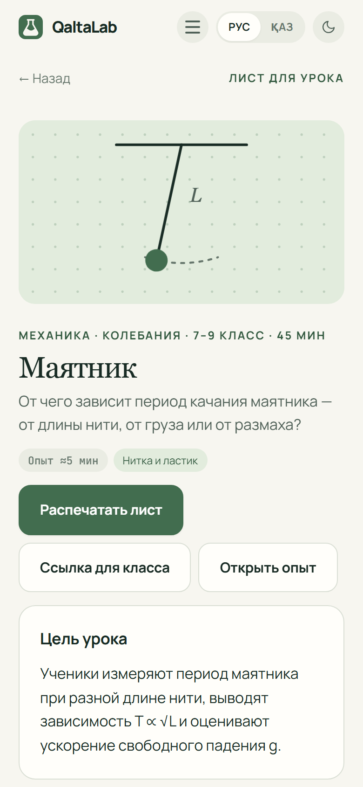

<div align="center">


# QaltaLab

**Лаборатория в кармане · Зертхана қалтаңда**

[**qaltalab.site**](https://qaltalab.site) &nbsp;·&nbsp; [Русский](#русский) &nbsp;·&nbsp; [Қазақша](#қазақша)

Сайт разработал **Идрисов Таир** (Tair Idrisov) · Сайтты әзірлеген — **Идрисов Таир**

</div>

<a id="русский"></a>


QaltaLab превращает обычный телефон в инструмент для настоящих STEM-экспериментов. Школьник задаёт вопрос, записывает гипотезу, измеряет телефоном, подбирает модель к **своим** точкам и сам открывает закон. Без лабораторного оборудования, без установки и без аккаунта.

| Попробовать | Где |
|---|---|
| Опыт за 2 минуты — нужен только экран | [qaltalab.site/#/lab/timing](https://qaltalab.site/#/lab/timing) |
| Готовый пример результата — если под рукой нет телефона | [qaltalab.site/#/demo/pendulum](https://qaltalab.site/#/demo/pendulum) |
| Лист для урока — для учителя | [qaltalab.site/#/lesson/pendulum](https://qaltalab.site/#/lesson/pendulum) |
| Пример общего графика класса | [qaltalab.site/#/class/demo](https://qaltalab.site/#/class/demo) |
| Все 10 опытов | [qaltalab.site](https://qaltalab.site) |

<table>
<tr>
<td align="center"><br><sub>Главная</sub></td>
<td align="center"><br><sub>Результат по своим данным</sub></td>
<td align="center"><br><sub>Разбор Zerde AI</sub></td>
<td align="center"><br><sub>Лист для урока</sub></td>
</tr>
</table>

## Проблема


В Казахстане **8 048** общеобразовательных школ ([Бюро национальной статистики, 31.08.2026](https://stat.gov.kz/ru/news/bolee-8-tysyach-shkol-kazakhstana-nachali-novyy-uchebnyy-god/)). По итогам **2024** года закуплено **1 621** современный предметный кабинет для **967** школ: **601** сельская и **366** городских ([Министерство просвещения РК](https://www.gov.kz/memleket/entities/edu/documents/details/836066)).

Оснащение идёт, но это число за один год, и кабинет есть не всегда и не у каждого — особенно дома, когда хочется попробовать самому. Для многих опытов уже достаточно устройства, которое есть рядом с учеником, — телефона.

По данным PISA 2022, базового уровня по естественным наукам в Казахстане достигают только **55%** пятнадцатилетних — в среднем по странам ОЭСР **76%** ([ОЭСР, PISA 2022](https://www.oecd.org/en/publications/pisa-2022-results-volume-i-and-ii-country-notes_ed6fbcc5-en/kazakhstan_8c403c04-en.html)). Почти каждый второй школьник знает науку как формулу на доске, а не как то, что можно измерить самому.

## Решение


Каждый опыт идёт по пяти шагам научного метода. Гипотеза записывается **до** измерения — ответом и рисунком: ученик пальцем рисует, каким ожидает график, а после опыта рисунок ложится пунктиром поверх настоящих точек, и сайт показывает, где и насколько интуиция разошлась с данными (метод «Предскажи — проверь — объясни»). Формулы на экране нет: ученик двигает ползунки, пока кривая не ляжет на его точки, а `R²` честно показывает, насколько модель описывает данные. На экране результата — что ты обнаружил, почему так произошло, сам закон и новый вопрос «а если попробовать иначе?».

## Эксперименты


| Опыт | Что измеряешь | Что нужно | Время |
|---|---|---|---|
| **Физика домбры** | частоту струны при разной длине — закон струны и октава | домбра или гитара, линейка, микрофон | ≈6 мин |
| Бутылочный оркестр | частоту звука при разном уровне воды | бутылка, вода, микрофон | ≈5 мин |
| Маятник | период колебаний и ускорение *g* | нитка и небольшой груз | ≈5 мин |
| Твой слух | верхнюю границу слышимых частот | динамик | ≈2 мин |
| Чувство времени | точность внутренних часов | только экран | ≈1 мин |
| Скорость мысли | время выбора — закон Хика | только экран | ≈3 мин |
| Закон Фиттса | время попадания в цель | только экран | ≈2 мин |
| Как быстро ты учишься | степенной закон практики | только экран | ≈4 мин |
| Магическое число семь | объём кратковременной памяти | только экран | ≈4 мин |
| Пульс камерой | восстановление пульса после нагрузки | камера и вспышка | ≈3 мин |

## Чем QaltaLab отличается

| | Учебник | Сенсорный инструмент | **QaltaLab** |
|---|:---:|:---:|:---:|
| Реальные измерения | — | ✓ | **✓** |
| Гипотеза до опыта | — | — | **✓** |
| Рисунок-предсказание против своих данных | — | — | **✓** |
| График своих данных | — | ✓ | **✓** |
| Ведёт от вопроса к выводу | — | частично | **✓** |
| Русский и казахский | зависит | зависит | **✓** |
| Работает в браузере | ✓ | зависит | **✓** |
| Ссылка для всего класса | — | зависит | **✓** |
| Общий график класса | — | — | **✓** |
| Разбор результата с AI | — | — | **✓** |

Сравниваются подходы, а не конкретные продукты. [phyphox](https://phyphox.org) (RWTH Aachen University) показывает, насколько мощным научным прибором может быть смартфон. QaltaLab решает другую задачу: провести школьника от вопроса и гипотезы до собственного вывода — прямо в браузере и на русском или казахском.

## Пилотное тестирование


Анкета после опыта, **n = 29**. Это самооценка участников, а не исследование успеваемости; возраст анкета не фиксировала.

| Вопрос | Ответы |
|---|---|
| Удобство с телефона | **4,83 / 5** · 5 из 5 — 24/29 (82,8%) · 4 или 5 — 29/29 |
| Общая оценка | **4,79 / 5** · 5 из 5 — 23/29 (79,3%) · 4 или 5 — 29/29 |
| Формат «попробуй сам — сразу увидь результат» помогает понимать STEM | «да» 21/29 (72,4%) · «скорее да» 8/29 (27,6%) · вместе **100%** |
| Хотели бы использовать на уроках или дома | «да» 22/29 (**75,9%**) · «возможно» 7/29 (24,1%) · «нет» 0 |
| Поняли, что такое QaltaLab, с первого раза | «да» 22/29 (75,9%) · «частично» 7/29 (24,1%) · «нет» 0 |
| Понравились интерактивные эксперименты | 28/29 (**96,6%**) |

**Что мы изменили по итогам.** 24,1% участников поняли продукт с первого раза только частично, поэтому первый экран переписан: сразу видно, что телефон становится прибором, а ученик получает собственные данные.

## Телефон как прибор


Показаны только возможности, которые опыты используют на самом деле: частоту звука микрофона раскладывает Web Audio API (`AnalyserNode`), пульс считается по яркости пальца на камере, время и реакция — по касаниям экрана, графики рисует Canvas. В каждом опыте есть блок «Под капотом» — путь от датчика до точки на графике, а в «Бутылочном оркестре» виден живой спектр звука и найденный пик.

## Физика домбры и общий график класса

«Физика домбры» — опыт, сделанный для школ Казахстана. Ученик зажимает струну на разных ладах, линейкой меряет длину звучащей части, а телефон слушает щипок и находит основной тон по гармоникам: громкий обертон не путается с основным тоном. Точки ложатся на гиперболу `f = a / L` — струна вдвое короче звучит на октаву выше. Это закон Мерсенна (1636), а лады как отношения длин струны описывал ещё Аль-Фараби в «Большой книге о музыке». Нет домбры — подойдёт гитара или натянутая резинка.

**Общий график класса** работает с любым опытом. Учитель нажимает «Провести с классом» и получает код и короткую ссылку `qaltalab.site/c/КОД`. Ученики проходят опыт на своих телефонах, а на экране класса для проектора точки всех учеников ложатся на один график; кривую по всем точкам сайт подбирает сам. Закон проявляется из данных класса, даже если у каждого по отдельности есть разброс. Имён нет: хранятся только код класса, id опыта и числа точек.

## Zerde AI

Zerde — наставник внутри опыта. На экране результата кнопка «Разобрать мой результат» отправляет числа этого опыта и получает разбор из четырёх частей: что ты обнаружил, почему так произошло, что говорят твои данные, что попробовать дальше. Слабые данные Zerde так и называет слабыми. В правом нижнем углу есть чат, который отвечает только про опыты QaltaLab и научный метод.

## Архитектура и приватность


- Измерения и подгонка модели выполняются в браузере. Без Zerde данные не покидают устройство.
- При разборе результата на `/api/zerde` уходят числа опыта: точки, `R²`, параметры модели, итог гипотезы и значения рисунка-предсказания в тех же точках. В чате — вопрос, до шести последних сообщений и числовой контекст открытого опыта. Имени и аккаунта нет.
- Ключ Groq хранится только в переменных окружения сервера. Сервер проверяет формат, ограничивает размер и частоту запросов.
- Если сервис недоступен, опыт и обычный разбор работают как прежде.
- В общем графике класса на `/api/class` уходят только код класса, id опыта и числа точек; хранилище — Supabase, таблицы закрыты, запись и чтение идут через функции с проверкой ввода и лимитами.

## Масштаб


Каждый шаг распространения почти ничего не стоит: учитель отправляет одну ссылку, ученики открывают опыт на своих телефонах, а к каждому опыту есть лист для урока. Новый опыт добавляется поверх общего движка — настройка, логика измерения и объяснение. Внедрения в школах пока нет: это механизм роста, а не отчёт о нём.

## Дорожная карта


## Научная основа

| На что опираемся | Источник |
|---|---|
| Активное обучение эффективнее лекции, хотя ученику кажется наоборот | Deslauriers et al., PNAS, 2019 — [doi:10.1073/pnas.1821936116](https://doi.org/10.1073/pnas.1821936116) |
| Активное обучение улучшает результаты в STEM, метаанализ 225 работ | Freeman et al., PNAS, 2014 — [doi:10.1073/pnas.1319030111](https://doi.org/10.1073/pnas.1319030111) |
| «Предскажи — проверь — объясни»: гипотеза до опыта | White & Gunstone, 1992 — [doi:10.4324/9780203761342](https://doi.org/10.4324/9780203761342) |
| Смартфон как школьный измерительный прибор | phyphox, RWTH Aachen — [phyphox.org](https://phyphox.org) |
| Закон Хика | Hick, 1952 — [doi:10.1080/17470215208416600](https://doi.org/10.1080/17470215208416600); Hyman, 1953 — [doi:10.1037/h0056940](https://doi.org/10.1037/h0056940) |
| Закон Фиттса | Fitts, 1954 — [doi:10.1037/h0055392](https://doi.org/10.1037/h0055392) |
| «Магическое число семь» | Miller, 1956 — [doi:10.1037/h0043158](https://doi.org/10.1037/h0043158) |

## Ограничения

- Результат зависит от устройства: микрофона, динамика, камеры, экрана, а также от шума и освещения.
- «Твой слух» и «Пульс камерой» — образовательные опыты, **не медицинская диагностика**.
- Разрешения на камеру и микрофон в браузерах работают по-разному; во встроенных браузерах мессенджеров они часто отключены.
- Пилотная выборка небольшая (n = 29).

## WIT Teens Challenge 2026

Кейс «STEM без сложного оборудования». QaltaLab отвечает на него прямо: прибор уже есть в кармане.

| Что просит кейс | Как это сделано |
|---|---|
| Интерактивность | ползунки модели, `R²` пересчитывается сразу |
| Доступность | браузер, без установки и аккаунта, RU и KZ |
| Обучение через эксперимент | свои измерения телефоном в каждом опыте |
| Можно ошибаться | гипотеза до опыта и честный разбор, если она не подтвердилась |
| Менять параметры | «А если попробовать иначе?» — повтор в новых условиях поверх прежних точек |
| Сразу видеть результат | график и закон на экране результата |

## Команда

| Участник | Роль |
|---|---|
| **Леонова Амелия** | капитан команды, презентация проекта |
| **Идрисов Таир** | автор и единственный разработчик сайта: весь код, дизайн, опыты, сервер и выкладка |
| **Омар Дамир** | участник команды |
| **Шарипов Арлан** | аналитик данных, пилотный опрос |
| **Аманжан Мади** | видеопрезентация и монтаж |

Лицензия [MIT](LICENSE). Фото на главной: Sorin Gheorghita, [Unsplash License](https://unsplash.com/license).

---

<a id="қазақша"></a>


QaltaLab қарапайым телефонды нағыз STEM-тәжірибелер құралына айналдырады. Оқушы сұрақ қояды, болжам жазады, телефонмен өлшейді, модельді **өз** нүктелеріне сәйкестендіреді және заңды өзі ашады. Зертхана жабдығынсыз, орнатусыз және аккаунтсыз.

| Байқап көру | Қайда |
|---|---|
| 2 минуттық тәжірибе — тек экран керек | [qaltalab.site/#/lab/timing](https://qaltalab.site/#/lab/timing) |
| Дайын нәтиже мысалы — телефон қолда болмаса | [qaltalab.site/#/demo/pendulum](https://qaltalab.site/#/demo/pendulum) |
| Сабаққа арналған парақ — мұғалімге | [qaltalab.site/#/lesson/pendulum](https://qaltalab.site/#/lesson/pendulum) |
| Сыныптың ортақ графигінің мысалы | [qaltalab.site/#/class/demo](https://qaltalab.site/#/class/demo) |
| Барлық 10 тәжірибе | [qaltalab.site](https://qaltalab.site) |

## Мәселе


Қазақстанда **8 048** жалпы білім беретін мектеп бар ([Ұлттық статистика бюросы, 31.08.2026](https://stat.gov.kz/ru/news/bolee-8-tysyach-shkol-kazakhstana-nachali-novyy-uchebnyy-god/)). **2024** жылдың қорытындысы бойынша **967** мектепке **1 621** заманауи пән кабинеті сатып алынды: оның **601**-і ауыл мектебі, **366**-сы қала мектебі ([ҚР Оқу-ағарту министрлігі](https://www.gov.kz/memleket/entities/edu/documents/details/836066)).

Жабдықтау жүріп жатыр, бірақ бұл бір жылдың саны, әрі кабинет әрдайым және әркімде бола бермейді — әсіресе үйде, бір нәрсені өзің байқап көргің келгенде. Көп тәжірибе үшін оқушының қасындағы құрылғы — телефон жеткілікті.

PISA 2022 деректері бойынша Қазақстанда жаратылыстану ғылымдары бойынша базалық деңгейге он бес жастағылардың тек **55%**-ы жетеді — ЭЫДҰ елдерінде орта есеппен **76%** ([ЭЫДҰ, PISA 2022](https://www.oecd.org/en/publications/pisa-2022-results-volume-i-and-ii-country-notes_ed6fbcc5-en/kazakhstan_8c403c04-en.html)). Әрбір екінші дерлік оқушы ғылымды өзі өлшей алатын нәрсе ретінде емес, тақтадағы формула ретінде біледі.

## Шешім


Әр тәжірибе ғылыми әдістің бес қадамынан өтеді. Болжам өлшеуге **дейін** жазылады — жауаппен және суретпен: оқушы графиктің қандай болатынын саусағымен салады, тәжірибеден кейін сурет нақты нүктелердің үстіне үзік сызықпен түседі, ал сайт түйсіктің деректерден қай жерде және қаншалықты алшақтағанын көрсетеді («Болжа — тексер — түсіндір» әдісі). Экранда формула жоқ: оқушы қисық нүктелеріне түскенше жүгірткілерді жылжытады, ал `R²` модельдің деректерді қаншалықты сипаттайтынын ашық көрсетеді. Нәтиже экранында — сен не таптың, неге олай болды, заңның өзі және «басқаша жасап көрсе ше?» деген жаңа сұрақ.

## Тәжірибелер


| Тәжірибе | Не өлшейсің | Не керек | Уақыты |
|---|---|---|---|
| **Домбыра физикасы** | әртүрлі ұзындықтағы ішек жиілігі — ішек заңы және октава | домбыра не гитара, сызғыш, микрофон | ≈6 мин |
| Бөтелке оркестрі | әртүрлі су деңгейіндегі дыбыс жиілігі | бөтелке, су, микрофон | ≈5 мин |
| Маятник | тербеліс периоды және *g* үдеуі | жіп және шағын жүк | ≈5 мин |
| Сенің есту қабілетің | естілетін жиіліктердің жоғарғы шекарасы | динамик | ≈2 мин |
| Уақытты сезіну | ішкі сағаттың дәлдігі | тек экран | ≈1 мин |
| Ой жылдамдығы | таңдау уақыты — Хик заңы | тек экран | ≈3 мин |
| Фиттс заңы | нысанаға тию уақыты | тек экран | ≈2 мин |
| Сен қаншалықты тез үйренесің | жаттығудың дәрежелік заңы | тек экран | ≈4 мин |
| Сиқырлы жеті саны | қысқа мерзімді жад көлемі | тек экран | ≈4 мин |
| Камерамен тамыр соғысы | жүктемеден кейін тамыр соғысының қалпына келуі | камера және жарқыл | ≈3 мин |

## QaltaLab неге өзгеше

| | Оқулық | Датчик-құрал | **QaltaLab** |
|---|:---:|:---:|:---:|
| Нақты өлшеулер | — | ✓ | **✓** |
| Тәжірибеге дейінгі болжам | — | — | **✓** |
| Сурет-болжауды өз деректеріңмен салыстыру | — | — | **✓** |
| Өз деректерің графигі | — | ✓ | **✓** |
| Сұрақтан қорытындыға дейін жетелейді | — | ішінара | **✓** |
| Орысша және қазақша | әртүрлі | әртүрлі | **✓** |
| Браузерде жұмыс істейді | ✓ | әртүрлі | **✓** |
| Бүкіл сыныпқа бір сілтеме | — | әртүрлі | **✓** |
| Сыныптың ортақ графигі | — | — | **✓** |
| Нәтижені AI-мен талдау | — | — | **✓** |

Нақты өнімдер емес, тәсілдер салыстырылады. [phyphox](https://phyphox.org) (RWTH Aachen University) смартфонның қаншалықты қуатты ғылыми құрал бола алатынын көрсетеді. QaltaLab басқа міндетті шешеді: оқушыны сұрақ пен болжамнан өз қорытындысына дейін жеткізу — тікелей браузерде, орыс не қазақ тілінде.

## Пилоттық тестілеу


Тәжірибеден кейінгі сауалнама, **n = 29**. Бұл — үлгерімді зерттеу емес, қатысушылардың өз бағасы; сауалнама жасты тіркеген жоқ.

| Сұрақ | Жауаптар |
|---|---|
| Телефоннан қолдану ыңғайлылығы | **4,83 / 5** · 5 балл — 24/29 (82,8%) · 4 не 5 — 29/29 |
| Жалпы баға | **4,79 / 5** · 5 балл — 23/29 (79,3%) · 4 не 5 — 29/29 |
| «Өзің жасап көр — нәтижесін бірден көр» форматы STEM-ді түсінуге көмектеседі | «иә» 21/29 (72,4%) · «иә болар» 8/29 (27,6%) · барлығы **100%** |
| Сабақта не үйде қолданғысы келеді | «иә» 22/29 (**75,9%**) · «мүмкін» 7/29 (24,1%) · «жоқ» 0 |
| QaltaLab не екенін бірден түсінді | «иә» 22/29 (75,9%) · «ішінара» 7/29 (24,1%) · «жоқ» 0 |
| Интерактивті тәжірибелер ұнады | 28/29 (**96,6%**) |

**Нәтиже бойынша не өзгерттік.** Қатысушылардың 24,1%-ы өнімді алғаш рет ішінара ғана түсінді, сондықтан бірінші экран қайта жазылды: телефон құралға айналатыны және оқушы өз деректерін алатыны бірден көрінеді.

## Телефон — зертхана құралы


Тек тәжірибелер шын пайдаланатын мүмкіндіктер көрсетілген: микрофон дыбысын Web Audio API (`AnalyserNode`) жиіліктерге жіктейді, тамыр соғысы камерадағы саусақ жарықтығымен есептеледі, уақыт пен реакция — экранға жанасумен, графиктерді Canvas салады. Әр тәжірибеде «Ішкі жағы» блогы бар — датчиктен графиктегі нүктеге дейінгі жол, ал «Бөтелке оркестрінде» дыбыстың тірі спектрі мен табылған шың көрінеді.

## Домбыра физикасы және сыныптың ортақ графигі

«Домбыра физикасы» — Қазақстан мектептері үшін жасалған тәжірибе. Оқушы ішекті әртүрлі пернелерде басып, дыбысталатын бөліктің ұзындығын сызғышпен өлшейді, ал телефон шертуді тыңдап, негізгі тонды гармоникалар бойынша табады: қатты обертон негізгі тонмен шатастырылмайды. Нүктелер `f = a / L` гиперболасына түседі — екі есе қысқа ішек бір октава жоғары дыбыстайды. Бұл — Мерсенн заңы (1636), ал пернелерді ішек ұзындықтарының қатынасы ретінде Әл-Фараби «Музыканың ұлы кітабында» сипаттаған. Домбыра болмаса — гитара не тартылған резеңке жарайды.

**Сыныптың ортақ графигі** кез келген тәжірибемен жұмыс істейді. Мұғалім «Сыныппен өткізу» батырмасын басып, код пен `qaltalab.site/c/КОД` қысқа сілтемесін алады. Оқушылар тәжірибені өз телефондарында өтеді, ал проекторға арналған сынып экранында барлық оқушының нүктелері бір графикке түседі; барлық нүкте бойынша қисықты сайт өзі таңдайды. Әр оқушыда шашырау болса да, заң сыныптың деректерінен көрінеді. Аты-жөн сақталмайды: тек сынып коды, тәжірибе id-і және нүктелер сандары.

## Zerde AI

Zerde — тәжірибе ішіндегі тәлімгер. Нәтиже экранындағы «Нәтижемді талдау» батырмасы осы тәжірибенің сандарын жіберіп, төрт бөлімнен тұратын талдау алады: сен не таптың, неге олай болды, деректерің не дейді, келесіде не байқап көруге болады. Әлсіз деректерді Zerde әлсіз деп атайды. Оң жақ төменгі бұрышта тек QaltaLab тәжірибелері мен ғылыми әдіс туралы жауап беретін чат бар.

## Архитектура және құпиялық


- Өлшеулер мен модельді сәйкестендіру браузерде орындалады. Zerde-сіз деректер құрылғыдан шықпайды.
- Нәтижені талдағанда `/api/zerde`-ге тәжірибе сандары жіберіледі: нүктелер, `R²`, модель параметрлері, болжамның қорытындысы және сол нүктелердегі сурет-болжаудың мәндері. Чатта — сұрақ, соңғы алты хабарламаға дейін және ашық тәжірибенің сандық контексті. Аты-жөн мен аккаунт жоқ.
- Groq кілті тек сервердің орта айнымалыларында сақталады. Сервер пішімін тексереді, сұраныс көлемі мен жиілігін шектейді.
- Қызмет қолжетімсіз болса, тәжірибе мен әдеттегі талдау бұрынғыдай жұмыс істейді.
- Сыныптың ортақ графигінде `/api/class`-қа тек сынып коды, тәжірибе id-і және нүктелер сандары жіберіледі; деректер Supabase-те сақталады, кестелер жабық, жазу мен оқу енгізуді тексеретін және шектейтін функциялар арқылы жүреді.

## Ауқым


Таратудың әр қадамы дерлік ештеңе тұрмайды: мұғалім бір сілтеме жібереді, оқушылар тәжірибені өз телефонында ашады, әр тәжірибеге сабақ парағы бар. Жаңа тәжірибе ортақ қозғалтқыштың үстіне қосылады — баптаулар, өлшеу логикасы және түсіндірме. Мектептерге енгізу әзірге жоқ: бұл — өсу тетігі, есеп емес.

## Даму жоспары


## Ғылыми негіз

| Неге сүйенеміз | Дереккөз |
|---|---|
| Белсенді оқу дәрістен тиімдірек, бірақ оқушыға керісінше көрінеді | Deslauriers et al., PNAS, 2019 — [doi:10.1073/pnas.1821936116](https://doi.org/10.1073/pnas.1821936116) |
| Белсенді оқу STEM-дегі нәтижелерді жақсартады, 225 жұмыстың метаталдауы | Freeman et al., PNAS, 2014 — [doi:10.1073/pnas.1319030111](https://doi.org/10.1073/pnas.1319030111) |
| «Болжа — тексер — түсіндір»: тәжірибеге дейінгі болжам | White & Gunstone, 1992 — [doi:10.4324/9780203761342](https://doi.org/10.4324/9780203761342) |
| Смартфон — мектептегі өлшеу құралы | phyphox, RWTH Aachen — [phyphox.org](https://phyphox.org) |
| Хик заңы | Hick, 1952 — [doi:10.1080/17470215208416600](https://doi.org/10.1080/17470215208416600); Hyman, 1953 — [doi:10.1037/h0056940](https://doi.org/10.1037/h0056940) |
| Фиттс заңы | Fitts, 1954 — [doi:10.1037/h0055392](https://doi.org/10.1037/h0055392) |
| «Сиқырлы жеті саны» | Miller, 1956 — [doi:10.1037/h0043158](https://doi.org/10.1037/h0043158) |

## Шектеулер

- Нәтиже құрылғыға — микрофонға, динамикке, камераға, экранға — және шу мен жарыққа байланысты.
- «Сенің есту қабілетің» мен «Камерамен тамыр соғысы» — білім беру тәжірибелері, **медициналық диагностика емес**.
- Камера мен микрофонға рұқсаттар браузерлерде әртүрлі жұмыс істейді; мессенджерлердің ішкі браузерлерінде олар жиі өшірулі.
- Пилоттық іріктеме шағын (n = 29).

## WIT Teens Challenge 2026

«Күрделі жабдықсыз STEM» кейсі. QaltaLab оған тікелей жауап береді: құрал қалтада бар.

| Кейс не сұрайды | Қалай жасалған |
|---|---|
| Интерактивтілік | модель жүгірткілері, `R²` бірден қайта есептеледі |
| Қолжетімділік | браузер, орнатусыз және аккаунтсыз, RU және KZ |
| Тәжірибе арқылы оқу | әр тәжірибеде телефонмен өз өлшеулерің |
| Қателесуге болады | тәжірибеге дейінгі болжам және расталмаса ашық талдау |
| Параметрлерді өзгерту | «Басқаша жасап көрсе ше?» — бұрынғы нүктелердің үстіне жаңа жағдайда қайталау |
| Нәтижені бірден көру | нәтиже экранындағы график пен заң |

## Команда

| Қатысушы | Рөлі |
|---|---|
| **Леонова Амелия** | команда капитаны, жоба презентациясы |
| **Идрисов Таир** | сайттың авторы және жалғыз әзірлеушісі: бүкіл код, дизайн, тәжірибелер, сервер және жариялау |
| **Омар Дамир** | команда мүшесі |
| **Шарипов Арлан** | деректер талдаушысы, пилоттық сауалнама |
| **Аманжан Мади** | бейнепрезентация және монтаж |

Лицензия [MIT](LICENSE). Басты беттегі фото: Sorin Gheorghita, [Unsplash License](https://unsplash.com/license).

---

<details>
<summary>Для разработчиков · Әзірлеушілерге</summary>

Сайт статический, без сборки и зависимостей: HTML, CSS и JavaScript. Серверная функция Zerde — `api/zerde.js` на Vercel, ключ `GROQ_API_KEY` в переменных окружения.

```
js/lab.js         движок опыта: пять шагов, результат, ссылки, экспорт PNG
js/labs/*.js      десять опытов, по файлу на опыт
js/fit.js         R² · js/chart.js графики · js/perm.js разрешения
js/zerde.js       разбор результата · js/zchat.js чат
js/facts.js       все цифры сайта: статистика и пилотный тест
js/lessons.js     листы для урока
api/zerde.js      проверка данных → Groq
tools/            проверка цифр README и сборка инфографики
```

```bash
node --test tests/core.test.mjs     # логика опытов
node tools/check-facts.js           # цифры README совпадают с js/facts.js
node tools/make-readme-assets.js    # пересобрать инфографику
```

</details>
